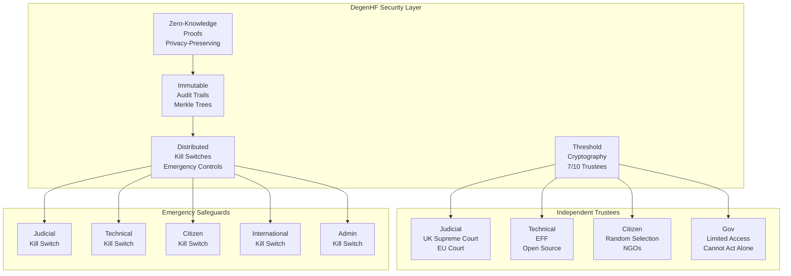
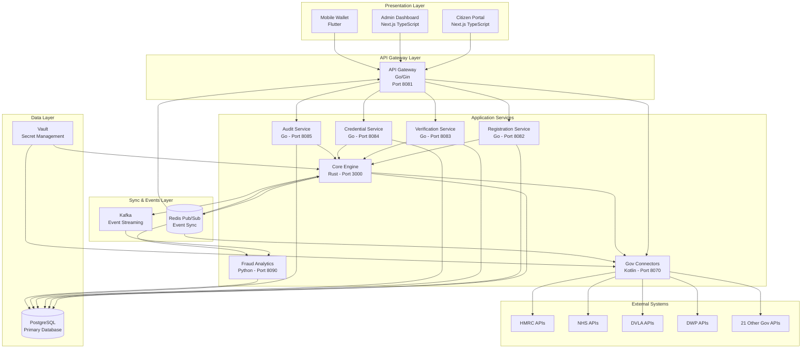
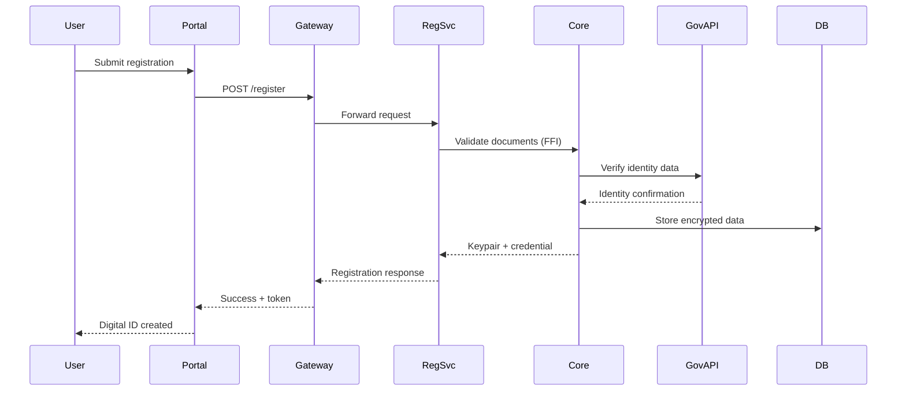
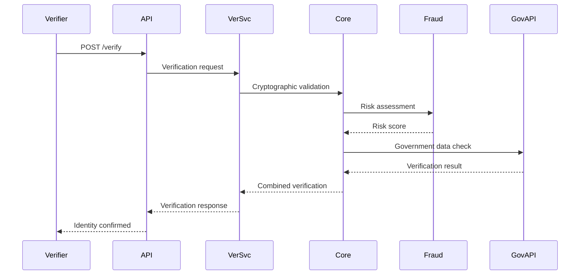

# 🏛️ UK Digital Identity Platform - Architecture Guide

## 📘 Overview

The UK Digital Identity Platform is an enterprise-grade, multi-language system designed to provide secure, privacy-preserving digital identity services for UK citizens and residents. The platform follows a microservices architecture with strong security boundaries and comprehensive government API integration.

## 🎯 Core Design Principles

### Security First
- **Zero Trust Architecture**: All services authenticate and authorize each other
- **End-to-End Encryption**: Data encrypted at rest and in transit
- **Hardware Security**: Integration with HSMs and secure enclaves
- **Selective Disclosure**: Citizens share only necessary information

### Privacy by Design
- **Data Minimization**: Only collect and store essential data
- **Purpose Limitation**: Data used only for stated purposes
- **Consent Management**: Explicit user consent for all operations
- **GDPR Compliance**: Full compliance with UK/EU data protection laws

### Scalability & Performance
- **Microservices**: Independently deployable and scalable services
- **Async Processing**: Event-driven architecture with Kafka streaming
- **Caching Strategy**: Multi-layer caching with Redis
- **Load Balancing**: Distributed traffic handling

## 🔐 DegenHF Security Architecture

**DegenHF** is the platform's revolutionary security framework that implements distributed trust and mathematical guarantees against both hacking and government misuse. It uses elliptic curve cryptography (ECC) combined with threshold cryptography to create an incorruptible security layer.

### Security Architecture Overview



### Distributed Trust Model

#### Trustee Categories
1. **Judicial Trustees**: UK Supreme Court, European Court of Human Rights
2. **Technical Trustees**: Electronic Frontier Foundation (EFF), Open Source Community
3. **Citizen Trustees**: Randomly selected citizens, NGO representatives
4. **Government Trustees**: Limited access, cannot authorize operations unilaterally

#### Threshold Requirements
- **Normal Operations**: 7/10 trustees must approve
- **Emergency Operations**: 9/10 trustees required
- **Citizen Opt-Out**: Citizens can opt-out of government access (default: access allowed)
- **Kill Switch Activation**: Varies by switch type (1-1000 signatures)

### Zero-Knowledge Proof System

#### Government Verification
```rust
// Verify government legitimacy without revealing data
pub fn verify_government_request(&self, request: GovernmentRequest) -> ZKP {
    // Create cryptographic proof of legitimacy
    // Prove compliance without exposing sensitive information
    // Maintain privacy while ensuring legal access
}
```

#### Audit Trail Integrity
```go
// Immutable logging with Merkle tree verification
type AuditLogger struct {
    entries    []AuditEntry
    merkleRoot []byte
}

func (a *AuditLogger) LogEvent(event AuditEntry) {
    // Append with cryptographic hash chaining
    // Maintain verifiable integrity
}
```

### Emergency Response Architecture

#### Kill Switch Hierarchy
1. **Judicial Kill Switch**: Supreme Court authorization (1 signature)
2. **Technical Kill Switch**: EFF + technical trustees (3 signatures)
3. **Citizen Kill Switch**: Mass citizen signatures (1000+ signatures)
4. **International Kill Switch**: UN/EU human rights bodies (2 signatures)
5. **Admin Kill Switch**: System administrators (1 signature)

#### Activation Triggers
- **System Compromise**: Detected security breach
- **Government Misuse**: Trustee consensus on abuse
- **Citizen Opt-Out Surge**: Mass opt-out requests triggering scrutiny
- **Legal Requirements**: Court orders
- **Maintenance**: Scheduled system updates

## 🏗️ System Architecture

### High-Level Architecture



## 🧩 Component Architecture

### 1. Rust Core Engine (Port 3000)

**Purpose**: High-performance cryptographic operations and identity verification

**Key Modules**:
- `crypto.rs`: RING + AES-GCM encryption, Blake3 hashing
- `verification.rs`: Multi-source identity verification
- `cache.rs`: Redis integration and TTL management
- `database.rs`: PostgreSQL audit logging
- `api.rs`: FFI exports for Go integration
- `sync.rs`: Cross-component synchronization

**Security Features**:
- Hardware-accelerated cryptography
- Memory-safe operations (Rust ownership model)
- Secure key derivation and storage
- Audit trail for all cryptographic operations

### 2. Go Microservices Suite (Ports 8081-8085)

**API Gateway (Port 8081)**:
- JWT authentication with bcrypt
- Rate limiting (100 req/min)
- Request routing and load balancing
- CORS and security headers

**Registration Service (Port 8082)**:
- User onboarding workflow
- Document validation pipeline
- Biometric template processing
- Integration with Core Engine FFI

**Verification Service (Port 8083)**:
- Identity verification orchestration
- Government API coordination
- Risk assessment integration
- Real-time fraud checking

**Credential Service (Port 8084)**:
- Digital credential issuance
- W3C Verifiable Credentials format
- Credential lifecycle management
- Selective disclosure support

**Audit Service (Port 8085)**:
- Comprehensive audit logging
- Kafka event production
- Compliance reporting
- GDPR audit trails

### 3. Government Connectors (Kotlin - Port 8070)

**25 Government API Integrations**:

| Category | APIs | Purpose |
|----------|------|---------|
| **Core Identity** | HMRC, DWP, NHS, DVLA | Tax, benefits, healthcare, licenses |
| **Immigration** | Home Office, Border Control | Work rights, immigration status |
| **Business** | Companies House, Financial Services, Business & Trade | Business verification |
| **Education** | Education Dept, Professional Bodies | Qualifications, certifications |
| **Legal** | Law Enforcement, Security Services, Courts | Criminal records, legal status |
| **Healthcare** | Healthcare Services, Transport | Medical records, transport permits |
| **Property** | Land Registry, Local Government | Property, council services |
| **Environment** | DEFRA, Housing & Communities | Environmental, housing |
| **Innovation** | Culture Media Sport, Energy Security, Science Innovation | Licenses, grants |

**Technical Features**:
- Spring Boot 3.1.0 reactive architecture
- Circuit breakers and retry patterns
- Response caching and rate limiting
- Comprehensive audit logging

### 4. Web Portals (TypeScript/Next.js)

**Citizen Portal (Port 3002)**:
- User registration and authentication
- Credential management dashboard
- Verification request interface
- Privacy and consent controls

**Admin Dashboard (Port 3001)**:
- User management interface
- System monitoring and analytics
- Government API status tracking
- Security incident management

**Technical Stack**:
- Next.js 14 with App Router
- TypeScript 5.0 for type safety
- Tailwind CSS for styling
- React Query for server state
- Zustand for client state

### 5. Mobile Wallet (Flutter)

**Features**:
- Cross-platform iOS/Android support
- Biometric authentication (Face/Touch ID)
- Offline credential storage with Hive
- QR code scanning and generation
- Secure credential sharing

**Security**:
- Flutter Secure Storage for credentials
- Local Auth for biometrics
- Certificate pinning for API calls
- Encrypted local database

### 6. Fraud Analytics (Python - Port 8090)

**ML Pipeline**:
- XGBoost, LightGBM, CatBoost ensemble
- TensorFlow/PyTorch deep learning
- Real-time Kafka event processing
- Graph analytics with NetworkX

**Fraud Detection Types**:
- Identity theft detection
- Synthetic identity recognition
- Account takeover prevention
- Document fraud analysis
- Behavioral anomaly detection
- Transaction fraud monitoring
- Application fraud detection
- Biometric spoofing prevention

## 🔄 Sync Architecture

### Event-Driven Synchronization

The platform implements comprehensive event-driven synchronization using Redis pub/sub for real-time cross-service communication and government feed integration.

**Key Components**:
- **Redis Pub/Sub**: Low-latency event distribution across all services
- **Government Feed Sync**: Real-time synchronization with 25 government APIs
- **Bidirectional Communication**: Services publish and subscribe to relevant events
- **Event Correlation**: Request IDs for tracking sync operations across services

### Sync Patterns

**Government Data Sync**:
- Government APIs publish data updates to Redis channels
- Services subscribe to relevant government feed events
- Real-time updates trigger verification and credential refreshes

**Cross-Service Events**:
- User registration events trigger fraud analysis
- Verification results published for audit logging
- Credential updates synchronized across all user interfaces

**Mobile & Web Sync**:
- WebSocket connections for real-time UI updates
- Background sync for offline-online transitions
- Event-driven state management in Flutter and React applications

## 🔄 Data Flow Architecture

### Registration Flow



### Verification Flow



## 🔐 Security Architecture

### Encryption at Rest
- **Database**: AES-256 encryption for all PII
- **Credentials**: Hardware-backed key encryption
- **Biometrics**: Salted hash templates only
- **Audit Logs**: Immutable, encrypted storage

### Encryption in Transit
- **mTLS**: All service-to-service communication
- **HTTPS**: All client-to-service communication
- **Certificate Pinning**: Mobile app security
- **Perfect Forward Secrecy**: Session key rotation

### Identity & Access Management
- **JWT Tokens**: Short-lived access tokens
- **Refresh Tokens**: Secure token renewal
- **RBAC**: Role-based access control
- **MFA**: Multi-factor authentication support

### Network Security
- **Zero Trust**: No implicit network trust
- **Network Segmentation**: Isolated service networks
- **VPC**: Private cloud networking
- **Firewall Rules**: Restrictive ingress/egress

## 📊 Monitoring & Observability

### Metrics Collection
- **Prometheus**: Service metrics and performance
- **Grafana**: Visual dashboards and alerting
- **Custom Metrics**: Business-specific indicators
- **SLA Monitoring**: 99.9% uptime tracking

### Distributed Tracing
- **Jaeger**: Request tracing across services
- **Correlation IDs**: Request flow tracking
- **Performance**: Bottleneck identification
- **Error Tracking**: Exception propagation

### Logging Strategy
- **Structured Logs**: JSON format for analysis
- **ELK Stack**: Centralized log aggregation
- **Log Levels**: Appropriate verbosity
- **Security Events**: Comprehensive audit trails

## 🚀 Deployment Architecture

### Container Orchestration
- **Docker**: Service containerization
- **Kubernetes**: Production orchestration
- **Helm Charts**: Deployment templates
- **Auto-scaling**: Dynamic resource allocation

### Multi-Environment Support
- **Development**: Local Docker Compose
- **Staging**: Kubernetes staging cluster
- **Production**: Multi-region Kubernetes
- **Disaster Recovery**: Cross-region backup

### CI/CD Pipeline
- **Git Workflows**: Feature branch strategy
- **Automated Testing**: Unit, integration, E2E
- **Security Scanning**: Vulnerability assessment
- **Blue-Green Deployment**: Zero-downtime updates

## 📈 Scalability Design

### Horizontal Scaling
- **Stateless Services**: Easy horizontal scaling
- **Load Balancing**: Traffic distribution
- **Database Sharding**: Data distribution
- **Cache Clustering**: Distributed caching

### Performance Optimization
- **Connection Pooling**: Database efficiency
- **Async Processing**: Non-blocking operations
- **CDN Integration**: Static asset delivery
- **Edge Computing**: Reduced latency

## 🔮 Future Enhancements

### Technology Roadmap
- **Quantum-Safe Cryptography**: Post-quantum algorithms
- **Advanced Biometrics**: Liveness detection
- **AI/ML Enhancement**: Improved fraud detection
- **Blockchain Integration**: Immutable audit trails

### Feature Roadmap
- **International Standards**: W3C DID compliance
- **Cross-Border Identity**: EU interoperability
- **IoT Integration**: Device identity management
- **Advanced Analytics**: Behavioral insights

---

*This architecture guide provides a comprehensive overview of the UK Digital Identity Platform's design and implementation. For specific implementation details, refer to individual component documentation.*