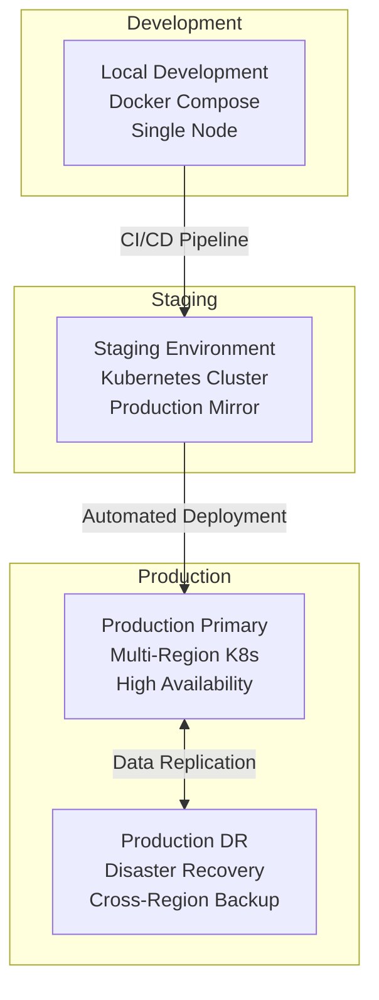

# 🚀 UK Digital Identity Platform - Deployment Guide

## 📘 Overview

This comprehensive deployment guide covers local development setup, staging deployment, and production deployment for the UK Digital Identity Platform. The platform supports multiple deployment strategies including Docker Compose for development and Kubernetes for production.

## 🏗️ Deployment Architecture

### Environment Strategy



## 🛠️ Prerequisites

### System Requirements

#### Development Environment
- **Operating System**: macOS, Linux, or Windows with WSL2
- **Memory**: Minimum 16GB RAM (32GB recommended)
- **Storage**: 50GB available disk space
- **CPU**: Multi-core processor (4+ cores recommended)

#### Software Dependencies
```bash
# Required software versions
Docker: 24.0+
Docker Compose: 2.20+
Kubernetes: 1.28+
Helm: 3.12+
kubectl: 1.28+

# Language runtimes for local development
Rust: 1.70+
Go: 1.21+
Node.js: 18.0+
Python: 3.9+
Java: 17+ (for Kotlin)
Flutter: 3.13+
```

### Infrastructure Requirements

#### Production Infrastructure
```yaml
# Minimum production requirements
compute:
  nodes: 9 # 3 master + 6 worker nodes
  cpu_per_node: 8 cores
  memory_per_node: 32GB
  storage_per_node: 500GB SSD

networking:
  load_balancer: Layer 7 (Application)
  ssl_termination: Required
  cdn: CloudFlare or equivalent
  
databases:
  postgresql:
    instances: 3 (HA cluster)
    storage: 2TB per instance
    backup: Cross-region replication
  
  redis:
    instances: 3 (cluster mode)
    memory: 16GB per instance
  
security:
  vault: HA deployment
  certificates: Automated renewal
  secrets: Hardware security modules
```

## 🏃‍♂️ Local Development Setup

### 1. Repository Setup

```bash
   ```bash
   # Clone repository
   git clone https://github.com/degenwithheart/UK-Digital-ID-Platform.git
   cd UK-Digital-ID-Platform
   ```

# Verify directory structure
ls -la
# Expected output:
# core-id-engine/
# digital-id-services/  
# gov-connectors/
# web-portal/
# mobile-wallet/
# fraud-analytics/
# infra/
# docs/
# README.md
```

### 2. Environment Configuration

```bash
# Copy environment template
cp infra/.env.example infra/.env

# Configure environment variables
nano infra/.env
```

```bash
# Development environment variables
# Database Configuration
DB_PASSWORD=dev_password_change_in_prod
POSTGRES_USER=postgres
POSTGRES_DB=digital_id

# Authentication
JWT_SECRET=development-jwt-secret-key-minimum-32-characters-long
SESSION_SECRET=development-session-secret-key

# Redis Configuration
REDIS_PASSWORD=dev_redis_password

# Government API Keys (Development/Mock)
HMRC_API_KEY=mock_hmrc_development_key
DVLA_API_KEY=mock_dvla_development_key
NHS_API_KEY=mock_nhs_development_key
DWP_API_KEY=mock_dwp_development_key

# Monitoring
PROMETHEUS_PASSWORD=prometheus_dev_password
GRAFANA_PASSWORD=grafana_dev_password

# Fraud Detection
FRAUD_MODEL_PATH=/app/models/
ML_MODEL_VERSION=1.0.0

# External Services
KAFKA_BOOTSTRAP_SERVERS=kafka:9092
VAULT_ADDR=http://vault:8200
VAULT_TOKEN=dev_vault_token

# Performance
RUST_LOG=info
GO_ENV=development
NODE_ENV=development
PYTHON_ENV=development

# Security (Development only - use Vault in production)
ENCRYPTION_KEY=dev_encryption_key_32_chars_min
SIGNING_KEY=dev_signing_key_for_development
```

### 3. Local Development Startup

```bash
# Build and start all services
docker-compose -f infra/docker-compose.yml up --build -d

# Verify services are running
docker-compose ps

# Expected output:
# NAME                    IMAGE                     STATUS
# digital-id-postgres     postgres:15-alpine        Up
# digital-id-redis        redis:7-alpine           Up  
# digital-id-kafka        confluentinc/cp-kafka    Up
# digital-id-rust-core    digital-id/core-engine   Up
# digital-id-go-gateway   digital-id/go-services   Up
# digital-id-kotlin       digital-id/gov-connect   Up
# digital-id-fraud        digital-id/fraud-ml      Up
# digital-id-citizen      digital-id/citizen-web   Up
# digital-id-admin        digital-id/admin-web     Up
# digital-id-prometheus   prom/prometheus          Up
# digital-id-grafana      grafana/grafana          Up
```

### 4. Service Health Verification

```bash
# Check service health endpoints
curl http://localhost:8081/health        # Go Gateway
curl http://localhost:8070/actuator/health   # Kotlin Connectors  
curl http://localhost:8090/health        # Python Fraud Analytics
curl http://localhost:3002               # Citizen Portal
curl http://localhost:3001               # Admin Dashboard

# Check database connectivity
docker-compose exec postgres psql -U postgres -d digital_id -c "SELECT version();"

# Check Kafka topics
docker-compose exec kafka kafka-topics.sh --bootstrap-server localhost:9092 --list
```

### 5. Development Workflow

#### Individual Service Development
```bash
# Rust Core Engine
cd core-id-engine
cargo run
cargo test
cargo build --release

# Go Services
cd digital-id-services
go mod tidy
go run gateway/main.go
go test ./...

# Kotlin Government Connectors
cd gov-connectors
./gradlew bootRun
./gradlew test

# Python Fraud Analytics
cd fraud-analytics
pip install -r requirements.txt
python detect_fraud.py
python -m pytest tests/

# TypeScript Web Portal
cd web-portal/citizen-portal
npm install
npm run dev
npm run test

# Flutter Mobile Wallet
cd mobile-wallet
flutter pub get
flutter run
flutter test
```

## 🏭 Production Deployment

### 1. Kubernetes Cluster Setup

#### Infrastructure Provisioning (Terraform)
```hcl
# infra/terraform/main.tf
provider "aws" {
  region = var.aws_region
}

# EKS Cluster
module "eks" {
  source = "terraform-aws-modules/eks/aws"
  
  cluster_name    = "digital-identity-prod"
  cluster_version = "1.28"
  
  vpc_id     = module.vpc.vpc_id
  subnet_ids = module.vpc.private_subnets
  
  node_groups = {
    main = {
      desired_capacity = 6
      max_capacity     = 12
      min_capacity     = 3
      
      instance_types = ["m5.2xlarge"]
      
      k8s_labels = {
        Environment = "production"
        Application = "digital-identity"
      }
    }
  }
}

# RDS PostgreSQL
module "postgresql" {
  source = "terraform-aws-modules/rds/aws"
  
  identifier = "digital-identity-postgres"
  
  engine            = "postgres"
  engine_version    = "15.4"
  instance_class    = "db.r5.2xlarge"
  allocated_storage = 2000
  
  multi_az = true
  backup_retention_period = 35
  
  vpc_security_group_ids = [aws_security_group.rds.id]
}
```

#### Deploy Infrastructure
```bash
# Initialize Terraform
cd infra/terraform
terraform init
terraform plan -var-file="production.tfvars"
terraform apply -var-file="production.tfvars"

# Configure kubectl
aws eks update-kubeconfig --region us-west-2 --name digital-identity-prod
```

### 2. Kubernetes Deployment

#### Namespace Setup
```bash
# Create namespaces
kubectl apply -f infra/k8s/namespace.yaml

# Verify namespaces
kubectl get namespaces
# Expected:
# digital-identity
# digital-identity-monitoring  
# digital-identity-system
```

#### Secret Management
```bash
# Create secrets using Kubernetes secrets or external secret operator
kubectl create secret generic api-secrets \
  --from-literal=jwt-secret="${JWT_SECRET}" \
  --from-literal=db-password="${DB_PASSWORD}" \
  --from-literal=redis-password="${REDIS_PASSWORD}" \
  --namespace=digital-identity

# Verify secrets
kubectl get secrets -n digital-identity
```

#### Service Deployment
```bash
# Deploy in dependency order

# 1. Data services
kubectl apply -f infra/k8s/data-services.yaml

# 2. Core services  
kubectl apply -f infra/k8s/core-services.yaml

# 3. Application services
kubectl apply -f infra/k8s/app-services.yaml

# 4. Monitoring services
kubectl apply -f infra/k8s/monitoring-services.yaml

# Verify deployments
kubectl get deployments -n digital-identity
kubectl get services -n digital-identity
kubectl get pods -n digital-identity
```

### 3. Helm Chart Deployment (Recommended)

#### Install Helm Chart
```bash
# Add custom Helm repository
helm repo add digital-identity https://helm-charts.digital-identity.gov.uk
helm repo update

# Install with custom values
helm install digital-identity digital-identity/uk-digital-id \
  --namespace digital-identity \
  --values infra/helm/digital-identity/values-production.yaml \
  --version 1.0.0

# Verify installation
helm list -n digital-identity
helm status digital-identity -n digital-identity
```

#### Custom Values Configuration
```yaml
# infra/helm/digital-identity/values-production.yaml
global:
  environment: production
  region: us-west-2
  domain: digital-identity.gov.uk

# Core Engine Configuration
coreEngine:
  image:
    repository: digital-identity/core-engine
    tag: "1.0.0"
  
  replicas: 3
  
  resources:
    requests:
      memory: "2Gi"
      cpu: "1000m"
    limits:
      memory: "4Gi" 
      cpu: "2000m"
  
  autoscaling:
    enabled: true
    minReplicas: 3
    maxReplicas: 10
    targetCPU: 70
    targetMemory: 80

# Gateway Configuration  
gateway:
  image:
    repository: digital-identity/go-gateway
    tag: "1.0.0"
  
  replicas: 3
  
  service:
    type: LoadBalancer
    port: 443
    
  ingress:
    enabled: true
    className: nginx
    hosts:
      - host: api.digital-identity.gov.uk
        paths:
          - path: /
            pathType: Prefix

# Database Configuration
postgresql:
  enabled: false # Using managed RDS
  externalHost: digital-identity-postgres.aws.rds.com
  externalPort: 5432

# Redis Configuration
redis:
  architecture: replication
  auth:
    enabled: true
  master:
    persistence:
      enabled: true
      size: 100Gi
```

### 4. Production Validation

#### Health Checks
```bash
# Service health validation
kubectl get pods -n digital-identity -o wide

# Check service endpoints
kubectl port-forward svc/go-gateway 8080:80 -n digital-identity &
curl http://localhost:8080/health

# Database connectivity
kubectl exec -it deployment/core-engine -n digital-identity -- \
  psql -h $DB_HOST -U $DB_USER -d digital_id -c "SELECT version();"

# Redis connectivity  
kubectl exec -it deployment/redis-master -n digital-identity -- \
  redis-cli ping
```

#### Performance Testing
```bash
# Load testing with k6
docker run --rm -i grafana/k6 run - <infra/tests/load-test.js

# Database performance
kubectl exec -it deployment/postgresql -n digital-identity -- \
  pgbench -h localhost -U postgres -d digital_id -c 10 -j 2 -t 1000
```

## 🔄 CI/CD Pipeline

### GitHub Actions Workflow
```yaml
# .github/workflows/deploy.yml
name: Deploy UK Digital Identity Platform

on:
  push:
    branches: [main]
  pull_request:
    branches: [main]

jobs:
  test:
    runs-on: ubuntu-latest
    steps:
    - uses: actions/checkout@v4
    
    - name: Setup multi-language environment
      uses: ./.github/actions/setup-environment
    
    - name: Run security tests
      run: |
        # Static analysis
        semgrep --config=security-rules.yml
        
        # Dependency scanning
        snyk test
        
        # Container scanning
        trivy fs .
    
    - name: Run unit tests
      run: |
        cd core-id-engine && cargo test
        cd digital-id-services && go test ./...
        cd gov-connectors && ./gradlew test
        cd fraud-analytics && python -m pytest
        cd web-portal && npm test
  
  build:
    needs: test
    runs-on: ubuntu-latest
    steps:
    - uses: actions/checkout@v4
    
    - name: Build Docker images
      run: |
        docker build -t digital-identity/core-engine:${{ github.sha }} core-id-engine/
        docker build -t digital-identity/go-services:${{ github.sha }} digital-id-services/
        docker build -t digital-identity/gov-connectors:${{ github.sha }} gov-connectors/
        docker build -t digital-identity/fraud-analytics:${{ github.sha }} fraud-analytics/
        docker build -t digital-identity/web-portal:${{ github.sha }} web-portal/
    
    - name: Push to registry
      run: |
        echo ${{ secrets.REGISTRY_PASSWORD }} | docker login -u ${{ secrets.REGISTRY_USERNAME }} --password-stdin
        docker push digital-identity/core-engine:${{ github.sha }}
        docker push digital-identity/go-services:${{ github.sha }}
        docker push digital-identity/gov-connectors:${{ github.sha }}
        docker push digital-identity/fraud-analytics:${{ github.sha }}
        docker push digital-identity/web-portal:${{ github.sha }}
  
  deploy-staging:
    needs: build
    runs-on: ubuntu-latest
    environment: staging
    steps:
    - name: Deploy to staging
      run: |
        helm upgrade digital-identity digital-identity/uk-digital-id \
          --namespace digital-identity-staging \
          --set global.image.tag=${{ github.sha }} \
          --values infra/helm/digital-identity/values-staging.yaml
  
  deploy-production:
    needs: deploy-staging
    runs-on: ubuntu-latest
    environment: production
    if: github.ref == 'refs/heads/main'
    steps:
    - name: Deploy to production
      run: |
        helm upgrade digital-identity digital-identity/uk-digital-id \
          --namespace digital-identity \
          --set global.image.tag=${{ github.sha }} \
          --values infra/helm/digital-identity/values-production.yaml
```

### Deployment Scripts

#### Automated Deployment Script
```bash
#!/bin/bash
# infra/scripts/deploy.sh

set -euo pipefail

ENVIRONMENT=${1:-development}
NAMESPACE="digital-identity"

if [[ "$ENVIRONMENT" == "production" ]]; then
    NAMESPACE="digital-identity-prod"
elif [[ "$ENVIRONMENT" == "staging" ]]; then
    NAMESPACE="digital-identity-staging"
fi

echo "🚀 Deploying UK Digital Identity Platform to $ENVIRONMENT"

# Pre-deployment checks
echo "🔍 Running pre-deployment checks..."
kubectl cluster-info
kubectl get nodes

# Database migration
echo "📊 Running database migrations..."
kubectl run migration-job --image=digital-identity/migrations:latest \
    --namespace=$NAMESPACE \
    --restart=Never \
    --env="DATABASE_URL=$DATABASE_URL" \
    --command -- /app/migrate

# Deploy services
if [[ "$ENVIRONMENT" == "development" ]]; then
    echo "🏃 Starting development environment..."
    docker-compose -f infra/docker-compose.yml up -d
else
    echo "☸️ Deploying to Kubernetes..."
    helm upgrade --install digital-identity ./infra/helm/digital-identity \
        --namespace=$NAMESPACE \
        --values=./infra/helm/digital-identity/values-$ENVIRONMENT.yaml \
        --wait \
        --timeout=600s
fi

# Post-deployment validation
echo "✅ Running post-deployment validation..."
./infra/scripts/validate-deployment.sh $ENVIRONMENT

echo "🎉 Deployment completed successfully!"
```

## 📊 Monitoring & Observability

### Monitoring Stack Deployment
```bash
# Deploy Prometheus monitoring
kubectl apply -f infra/k8s/monitoring-services.yaml

# Access Grafana dashboard
kubectl port-forward svc/grafana 3000:80 -n digital-identity-monitoring

# Prometheus metrics
kubectl port-forward svc/prometheus 9090:80 -n digital-identity-monitoring
```

### Key Metrics to Monitor
```yaml
# Production monitoring checklist
service_health:
  - api_response_time: <100ms (95th percentile)
  - error_rate: <1%
  - uptime: >99.9%

resource_usage:
  - cpu_utilization: <70%
  - memory_usage: <80%
  - disk_usage: <85%

business_metrics:
  - registrations_per_minute: baseline ±20%
  - verifications_per_minute: baseline ±20%
  - fraud_detection_accuracy: >95%

security_metrics:
  - failed_login_attempts: <10/minute
  - api_authentication_failures: <5/minute
  - certificate_expiry: >30 days
```

## 🔧 Troubleshooting

### Common Issues

#### Service Discovery Problems
```bash
# Check DNS resolution
kubectl exec -it deployment/go-gateway -- nslookup postgresql

# Verify service endpoints
kubectl get endpoints -n digital-identity

# Test service connectivity
kubectl exec -it deployment/go-gateway -- \
  curl http://kotlin-connectors:8070/actuator/health
```

#### Database Connection Issues
```bash
# Check PostgreSQL status
kubectl logs deployment/postgresql -n digital-identity

# Verify connection string
kubectl exec -it deployment/go-gateway -- \
  env | grep DATABASE_URL

# Test direct connection
kubectl run debug-pod --image=postgres:15 -it --rm -- \
  psql -h postgresql -U postgres -d digital_id
```

#### Performance Issues
```bash
# Check resource usage
kubectl top nodes
kubectl top pods -n digital-identity

# Analyze slow queries
kubectl exec -it deployment/postgresql -- \
  psql -d digital_id -c "SELECT query, mean_time FROM pg_stat_statements ORDER BY mean_time DESC LIMIT 10;"

# Review application logs
kubectl logs deployment/go-gateway -n digital-identity --tail=100 -f
```

### Emergency Procedures

#### Service Rollback
```bash
# Helm rollback
helm rollback digital-identity -n digital-identity

# Manual rollback
kubectl rollout undo deployment/go-gateway -n digital-identity

# Verify rollback
kubectl rollout status deployment/go-gateway -n digital-identity
```

#### Database Recovery
```bash
# Restore from backup
kubectl exec -it deployment/postgresql -- \
  pg_restore -h localhost -U postgres -d digital_id /backups/latest.dump

# Point-in-time recovery
kubectl exec -it deployment/postgresql -- \
  pg_basebackup -h backup-server -D /var/lib/postgresql/data -U replication -P -W
```

---

*This deployment guide provides comprehensive instructions for deploying the UK Digital Identity Platform across all environments. Regular updates ensure compatibility with evolving infrastructure requirements.*