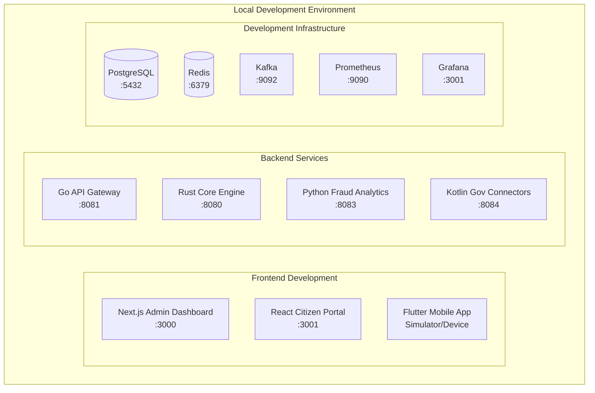

# 👩‍💻 UK Digital Identity Platform - Developer Guide

## 🎯 Overview

This guide provides comprehensive information for developers working on the UK Digital Identity Platform. It covers development setup, coding standards, testing procedures, and contribution guidelines.

## 🛠️ Development Environment Setup

### Prerequisites

| Component | Version | Purpose |
|-----------|---------|---------|
| **Docker** | 24.0+ | Container orchestration |
| **Docker Compose** | 2.20+ | Multi-container applications |
| **Node.js** | 18.x LTS | Frontend development |
| **Go** | 1.21+ | Microservices development |
| **Rust** | 1.70+ | Core engine development |
| **Python** | 3.11+ | Fraud detection & analytics |
| **Java/Kotlin** | JDK 17+ | Government API connectors |
| **Flutter** | 3.13+ | Mobile app development |

### Initial Setup

1. **Clone Repository**
   ```bash
   git clone https://github.com/degenwithheart/UK-Digital-ID-Platform.git
   cd UK-Digital-ID-Platform
   ```

2. **Environment Configuration**
   ```bash
   # Copy environment templates
   cp .env.example .env
   cp .env.local.example .env.local
   
   # Generate encryption keys
   ./scripts/generate-keys.sh
   
   # Initialize configuration
   ./scripts/init-config.sh
   ```

3. **Development Dependencies**
   ```bash
   # Install Docker and Docker Compose
   # macOS
   brew install docker docker-compose
   
   # Ubuntu/Debian
   sudo apt-get install docker.io docker-compose
   
   # Install language-specific tools
   npm install -g @angular/cli typescript
   go install golang.org/x/tools/gopls@latest
   rustup component add clippy rustfmt
   pip install black isort mypy
   ```

4. **Start Development Environment**
   ```bash
   # Start all services
   docker-compose -f infra/docker-compose.yml up -d
   
   # Verify services are running
   ./scripts/check-system-status.sh
   ```

### Development Architecture



## 🏗️ Component Development

### Rust Core Engine Development

#### Project Structure
```
core-id-engine/
├── Cargo.toml              # Dependencies and metadata
├── src/
│   ├── main.rs            # Application entry point
│   ├── lib.rs             # Library root
│   ├── api.rs             # REST API handlers
│   ├── crypto.rs          # Cryptographic operations
│   ├── database.rs        # Database interactions
│   ├── verification.rs    # Identity verification logic
│   ├── audit.rs           # Audit logging
│   ├── cache.rs           # Redis caching
│   ├── metrics.rs         # Performance monitoring
│   ├── config.rs          # Configuration management
│   └── integration.rs     # FFI bindings
└── tests/                 # Unit and integration tests
```

#### Development Commands
```bash
cd core-id-engine

# Build in development mode
cargo build

# Run with hot reload
cargo watch -x run

# Run tests
cargo test
cargo test --release        # Optimized tests
cargo test -- --nocapture  # Show println! output

# Linting and formatting
cargo clippy               # Static analysis
cargo fmt                 # Code formatting
cargo audit               # Security vulnerabilities

# FFI library build
cargo build --release --lib
```

#### Key Development Practices
```rust
// Error handling pattern
use anyhow::{Context, Result};

pub fn verify_identity(data: &IdentityData) -> Result<VerificationResult> {
    let encrypted_data = encrypt_sensitive_data(data)
        .context("Failed to encrypt identity data")?;
    
    let verification = perform_verification(&encrypted_data)
        .context("Identity verification failed")?;
    
    Ok(verification)
}

// Async operations
use tokio;

#[tokio::main]
async fn main() -> Result<()> {
    let config = Config::from_env()?;
    let app = create_app(config).await?;
    app.run().await
}

// FFI exports
#[no_mangle]
pub extern "C" fn verify_user_ffi(
    data_ptr: *const c_char,
    result_ptr: *mut VerificationResult
) -> i32 {
    // Safe FFI implementation
}
```

### Go Microservices Development

#### Project Structure
```
digital-id-services/
├── go.mod                 # Module definition
├── gateway/
│   ├── main.go           # API Gateway service
│   └── handlers/         # HTTP handlers
├── registration/
│   └── main.go           # User registration service
├── verification/
│   └── main.go           # Identity verification service
├── credential/
│   └── main.go           # Credential management service
├── audit/
│   └── main.go           # Audit logging service
└── shared/
    ├── models/           # Shared data models
    ├── middleware/       # HTTP middleware
    └── utils/           # Utility functions
```

#### Development Commands
```bash
cd digital-id-services

# Install dependencies
go mod tidy
go mod download

# Run specific service
go run gateway/main.go
go run registration/main.go

# Run with auto-reload
go install github.com/cosmtrek/air@latest
air -c .air.toml

# Testing
go test ./...
go test -v ./gateway/...    # Verbose output
go test -race ./...         # Race condition detection
go test -cover ./...        # Coverage report

# Build for production
go build -o bin/gateway ./gateway
go build -o bin/registration ./registration

# Cross-compilation
GOOS=linux GOARCH=amd64 go build -o bin/gateway-linux ./gateway
```

#### Key Development Patterns
```go
// Context handling
func (h *Handler) VerifyIdentity(w http.ResponseWriter, r *http.Request) {
    ctx, cancel := context.WithTimeout(r.Context(), 30*time.Second)
    defer cancel()
    
    result, err := h.verificationService.Verify(ctx, req)
    if err != nil {
        http.Error(w, err.Error(), http.StatusInternalServerError)
        return
    }
    
    json.NewEncoder(w).Encode(result)
}

// Middleware pattern
func AuthMiddleware(next http.Handler) http.Handler {
    return http.HandlerFunc(func(w http.ResponseWriter, r *http.Request) {
        token := r.Header.Get("Authorization")
        if !validateToken(token) {
            http.Error(w, "Unauthorized", http.StatusUnauthorized)
            return
        }
        next.ServeHTTP(w, r)
    })
}

// Error handling
type APIError struct {
    Code    string `json:"code"`
    Message string `json:"message"`
    Details map[string]interface{} `json:"details,omitempty"`
}

func (e APIError) Error() string {
    return e.Message
}
```

### Python Analytics Development

#### Project Structure
```
fraud-analytics/
├── requirements.txt       # Python dependencies
├── fraud_config.yaml     # ML model configuration
├── detect_fraud.py       # Main fraud detection
├── generate_data.py      # Synthetic data generation
├── dashboard.py          # Analytics dashboard
├── models/
│   ├── ensemble.py       # Ensemble ML models
│   ├── preprocessing.py  # Data preprocessing
│   └── evaluation.py     # Model evaluation
└── tests/
    └── test_detection.py # Unit tests
```

#### Development Commands
```bash
cd fraud-analytics

# Virtual environment setup
python -m venv venv
source venv/bin/activate  # Linux/macOS
venv\Scripts\activate     # Windows

# Install dependencies
pip install -r requirements.txt
pip install -e .          # Editable installation

# Development dependencies
pip install pytest black isort mypy flake8

# Run fraud detection
python detect_fraud.py

# Run dashboard
streamlit run dashboard.py

# Testing
pytest
pytest -v                 # Verbose output
pytest --cov=fraud_analytics  # Coverage report

# Code quality
black .                   # Code formatting
isort .                   # Import sorting
flake8 .                  # Linting
mypy .                    # Type checking
```

#### Key Development Practices
```python
# Type hints
from typing import Dict, List, Optional, Tuple
import numpy as np
import pandas as pd

def detect_fraud(
    transaction_data: pd.DataFrame,
    model_weights: Dict[str, float]
) -> Tuple[np.ndarray, float]:
    """
    Detect fraudulent transactions using ensemble models.
    
    Args:
        transaction_data: Input transaction features
        model_weights: Ensemble model weights
        
    Returns:
        Tuple of (predictions, confidence_score)
    """
    predictions = ensemble_predict(transaction_data, model_weights)
    confidence = calculate_confidence(predictions)
    return predictions, confidence

# Configuration management
import yaml
from dataclasses import dataclass

@dataclass
class FraudConfig:
    threshold: float
    model_version: str
    features: List[str]
    
    @classmethod
    def from_yaml(cls, path: str) -> 'FraudConfig':
        with open(path) as f:
            data = yaml.safe_load(f)
        return cls(**data)

# Async operations with asyncio
import asyncio
import aiohttp

async def analyze_transaction_async(transaction_id: str) -> Dict:
    async with aiohttp.ClientSession() as session:
        async with session.post(
            f"/api/analyze/{transaction_id}"
        ) as response:
            return await response.json()
```

### Frontend Development

#### React/Next.js Development
```bash
cd web-portal/citizen-portal

# Install dependencies
npm install
npm install --save-dev @types/react @types/node

# Development server
npm run dev

# Type checking
npm run type-check

# Linting
npm run lint
npm run lint:fix

# Testing
npm test
npm run test:watch
npm run test:coverage

# Build for production
npm run build
npm start
```

#### React Component Patterns
```typescript
// Functional component with hooks
import React, { useState, useEffect } from 'react';
import { User } from '../types/user';

interface UserProfileProps {
  userId: string;
  onUpdate: (user: User) => void;
}

export const UserProfile: React.FC<UserProfileProps> = ({ 
  userId, 
  onUpdate 
}) => {
  const [user, setUser] = useState<User | null>(null);
  const [loading, setLoading] = useState(true);
  const [error, setError] = useState<string | null>(null);

  useEffect(() => {
    const fetchUser = async () => {
      try {
        setLoading(true);
        const response = await fetch(`/api/users/${userId}`);
        if (!response.ok) throw new Error('Failed to fetch user');
        const userData = await response.json();
        setUser(userData);
      } catch (err) {
        setError(err instanceof Error ? err.message : 'Unknown error');
      } finally {
        setLoading(false);
      }
    };

    fetchUser();
  }, [userId]);

  if (loading) return <div>Loading...</div>;
  if (error) return <div>Error: {error}</div>;
  if (!user) return <div>User not found</div>;

  return (
    <div className="user-profile">
      <h2>{user.name}</h2>
      <p>Email: {user.email}</p>
      <p>Verification Level: {user.verificationLevel}</p>
    </div>
  );
};
```

#### Flutter Mobile Development
```bash
cd mobile-wallet

# Get dependencies
flutter pub get

# Run on device/simulator
flutter run
flutter run --debug
flutter run --profile
flutter run --release

# Testing
flutter test
flutter test --coverage

# Code generation
flutter packages pub run build_runner build

# Build for release
flutter build apk
flutter build ios
flutter build web
```

#### Flutter Widget Patterns
```dart
// Stateful widget with async operations
class IdentityVerificationScreen extends StatefulWidget {
  final String userId;
  
  const IdentityVerificationScreen({
    Key? key,
    required this.userId,
  }) : super(key: key);

  @override
  _IdentityVerificationScreenState createState() => 
      _IdentityVerificationScreenState();
}

class _IdentityVerificationScreenState 
    extends State<IdentityVerificationScreen> {
  late Future<VerificationStatus> _verificationFuture;
  
  @override
  void initState() {
    super.initState();
    _verificationFuture = _loadVerificationStatus();
  }
  
  Future<VerificationStatus> _loadVerificationStatus() async {
    final response = await http.get(
      Uri.parse('/api/verify/${widget.userId}'),
    );
    
    if (response.statusCode == 200) {
      return VerificationStatus.fromJson(
        json.decode(response.body)
      );
    } else {
      throw Exception('Failed to load verification status');
    }
  }
  
  @override
  Widget build(BuildContext context) {
    return Scaffold(
      appBar: AppBar(title: const Text('Identity Verification')),
      body: FutureBuilder<VerificationStatus>(
        future: _verificationFuture,
        builder: (context, snapshot) {
          if (snapshot.hasData) {
            return VerificationStatusWidget(
              status: snapshot.data!
            );
          } else if (snapshot.hasError) {
            return ErrorWidget(error: snapshot.error.toString());
          }
          return const CircularProgressIndicator();
        },
      ),
    );
  }
}
```

## 🧪 Testing Strategy

### Test Pyramid Structure
```mermaid
pyramid
    title Test Pyramid
    "E2E Tests (10%)" : 10 : "#FF6B6B"
    "Integration Tests (20%)" : 20 : "#4ECDC4"
    "Unit Tests (70%)" : 70 : "#45B7D1"
```

### Unit Testing

#### Rust Unit Tests
```rust
#[cfg(test)]
mod tests {
    use super::*;
    
    #[test]
    fn test_encrypt_decrypt_identity_data() {
        let original_data = IdentityData {
            name: "John Smith".to_string(),
            date_of_birth: "1985-06-15".to_string(),
            national_insurance: "AB123456C".to_string(),
        };
        
        let encrypted = encrypt_identity_data(&original_data).unwrap();
        assert_ne!(encrypted.data, original_data.name.as_bytes());
        
        let decrypted = decrypt_identity_data(&encrypted).unwrap();
        assert_eq!(decrypted, original_data);
    }
    
    #[tokio::test]
    async fn test_async_verification() {
        let mock_data = create_mock_identity_data();
        let result = verify_identity_async(&mock_data).await;
        
        assert!(result.is_ok());
        assert_eq!(result.unwrap().verification_level, 2);
    }
}
```

#### Go Unit Tests
```go
func TestUserRegistration(t *testing.T) {
    tests := []struct {
        name     string
        input    RegisterRequest
        expected int
        hasError bool
    }{
        {
            name: "Valid registration",
            input: RegisterRequest{
                Email: "test@example.com",
                Name:  "Test User",
            },
            expected: 201,
            hasError: false,
        },
        {
            name: "Invalid email",
            input: RegisterRequest{
                Email: "invalid-email",
                Name:  "Test User",
            },
            expected: 400,
            hasError: true,
        },
    }
    
    for _, tt := range tests {
        t.Run(tt.name, func(t *testing.T) {
            handler := NewRegistrationHandler()
            
            body, _ := json.Marshal(tt.input)
            req := httptest.NewRequest("POST", "/register", bytes.NewReader(body))
            w := httptest.NewRecorder()
            
            handler.Register(w, req)
            
            assert.Equal(t, tt.expected, w.Code)
        })
    }
}
```

#### Python Unit Tests
```python
import pytest
import numpy as np
import pandas as pd
from fraud_analytics.detect_fraud import FraudDetector

class TestFraudDetector:
    @pytest.fixture
    def detector(self):
        return FraudDetector(config_path="test_config.yaml")
    
    @pytest.fixture
    def sample_transaction(self):
        return pd.DataFrame({
            'amount': [100.0],
            'time_of_day': [14.5],
            'location_risk': [0.3],
            'user_history_score': [0.8]
        })
    
    def test_fraud_detection_normal_transaction(self, detector, sample_transaction):
        predictions, confidence = detector.detect(sample_transaction)
        
        assert len(predictions) == 1
        assert 0.0 <= confidence <= 1.0
        assert predictions[0] in [0, 1]  # Binary classification
    
    def test_fraud_detection_high_risk_transaction(self, detector):
        high_risk_transaction = pd.DataFrame({
            'amount': [10000.0],  # Very high amount
            'time_of_day': [3.0], # Unusual time
            'location_risk': [0.9], # High risk location
            'user_history_score': [0.1] # Poor history
        })
        
        predictions, confidence = detector.detect(high_risk_transaction)
        
        assert predictions[0] == 1  # Should detect as fraud
        assert confidence > 0.7     # High confidence
    
    @pytest.mark.asyncio
    async def test_async_fraud_analysis(self, detector):
        transaction_id = "txn_123456"
        result = await detector.analyze_async(transaction_id)
        
        assert 'risk_score' in result
        assert 'prediction' in result
        assert isinstance(result['risk_score'], float)
```

### Integration Testing

#### API Integration Tests
```typescript
// Jest integration test
describe('Authentication API Integration', () => {
  let server: Server;
  let authToken: string;
  
  beforeAll(async () => {
    server = await createTestServer();
  });
  
  afterAll(async () => {
    await server.close();
  });
  
  describe('POST /api/v1/auth/login', () => {
    it('should authenticate valid user', async () => {
      const response = await request(server)
        .post('/api/v1/auth/login')
        .send({
          email: 'test@example.com',
          password: 'ValidPassword123!'
        })
        .expect(200);
      
      expect(response.body.success).toBe(true);
      expect(response.body.data.token).toBeDefined();
      expect(response.body.data.user.email).toBe('test@example.com');
      
      authToken = response.body.data.token;
    });
    
    it('should reject invalid credentials', async () => {
      const response = await request(server)
        .post('/api/v1/auth/login')
        .send({
          email: 'test@example.com',
          password: 'InvalidPassword'
        })
        .expect(401);
      
      expect(response.body.success).toBe(false);
      expect(response.body.error.code).toBe('INVALID_CREDENTIALS');
    });
  });
  
  describe('GET /api/v1/users/profile', () => {
    it('should return user profile with valid token', async () => {
      const response = await request(server)
        .get('/api/v1/users/profile')
        .set('Authorization', `Bearer ${authToken}`)
        .expect(200);
      
      expect(response.body.data.email).toBe('test@example.com');
    });
  });
});
```

### End-to-End Testing

#### Playwright E2E Tests
```typescript
import { test, expect } from '@playwright/test';

test.describe('Digital Identity Registration Flow', () => {
  test('complete user registration and verification', async ({ page }) => {
    // Navigate to registration page
    await page.goto('/register');
    
    // Fill registration form
    await page.fill('[data-testid="name-input"]', 'John Smith');
    await page.fill('[data-testid="email-input"]', 'john.smith@example.com');
    await page.fill('[data-testid="password-input"]', 'SecurePass123!');
    await page.fill('[data-testid="confirm-password-input"]', 'SecurePass123!');
    
    // Accept terms and conditions
    await page.check('[data-testid="terms-checkbox"]');
    await page.check('[data-testid="privacy-checkbox"]');
    
    // Submit registration
    await page.click('[data-testid="register-button"]');
    
    // Verify registration success
    await expect(page.locator('[data-testid="success-message"]'))
      .toContainText('Registration successful');
    
    // Navigate to verification page
    await page.click('[data-testid="start-verification-button"]');
    
    // Upload document
    await page.setInputFiles(
      '[data-testid="document-upload"]', 
      'test-files/sample-passport.jpg'
    );
    
    // Wait for upload completion
    await expect(page.locator('[data-testid="upload-status"]'))
      .toContainText('Upload complete');
    
    // Submit for verification
    await page.click('[data-testid="submit-verification-button"]');
    
    // Verify submission success
    await expect(page.locator('[data-testid="verification-status"]'))
      .toContainText('Verification in progress');
  });
});
```

## 📏 Code Standards

### Code Style Guidelines

#### Rust Style
```rust
// Use descriptive names
pub struct IdentityVerificationRequest {
    user_id: Uuid,
    document_type: DocumentType,
    biometric_data: Option<BiometricData>,
}

// Prefer Result types for error handling
pub fn process_verification(
    request: &IdentityVerificationRequest
) -> Result<VerificationResult, VerificationError> {
    // Implementation
}

// Use appropriate visibility
pub(crate) fn internal_helper() {
    // Internal function
}

// Document public APIs
/// Verifies user identity using government databases and biometric matching.
/// 
/// # Arguments
/// 
/// * `request` - The verification request containing user data and documents
/// 
/// # Returns
/// 
/// Returns `Ok(VerificationResult)` on successful verification, or 
/// `Err(VerificationError)` if verification fails.
pub fn verify_identity(
    request: IdentityVerificationRequest
) -> Result<VerificationResult, VerificationError> {
    // Implementation
}
```

#### Go Style
```go
// Use package-level comments
// Package registration handles user registration and account creation
// for the UK Digital Identity Platform.
package registration

// Use descriptive struct names with proper JSON tags
type UserRegistrationRequest struct {
    Name        string `json:"name" validate:"required,min=2,max=100"`
    Email       string `json:"email" validate:"required,email"`
    Password    string `json:"password" validate:"required,min=8"`
    DateOfBirth string `json:"date_of_birth" validate:"required,datetime=2006-01-02"`
}

// Use context.Context for cancellation
func (s *Service) RegisterUser(
    ctx context.Context, 
    req UserRegistrationRequest
) (*User, error) {
    // Check context cancellation
    select {
    case <-ctx.Done():
        return nil, ctx.Err()
    default:
    }
    
    // Implementation
}

// Use meaningful error types
type ValidationError struct {
    Field   string
    Message string
}

func (e ValidationError) Error() string {
    return fmt.Sprintf("validation failed for field '%s': %s", e.Field, e.Message)
}
```

#### Python Style
```python
"""
UK Digital Identity Platform - Fraud Detection Module

This module provides machine learning-based fraud detection capabilities
for identity verification transactions.
"""

from typing import Dict, List, Optional, Tuple, Union
import logging

logger = logging.getLogger(__name__)

class FraudDetectionConfig:
    """Configuration for fraud detection algorithms."""
    
    def __init__(
        self,
        threshold: float = 0.7,
        model_version: str = "2.1.0",
        features: Optional[List[str]] = None
    ) -> None:
        self.threshold = threshold
        self.model_version = model_version
        self.features = features or self._default_features()
    
    def _default_features(self) -> List[str]:
        """Return default feature list for fraud detection."""
        return [
            "transaction_amount",
            "time_of_day",
            "location_risk_score",
            "user_history_score"
        ]

def detect_fraud_patterns(
    transaction_data: pd.DataFrame,
    config: FraudDetectionConfig
) -> Tuple[np.ndarray, float]:
    """
    Analyze transaction data for fraudulent patterns.
    
    Args:
        transaction_data: Input transaction features
        config: Fraud detection configuration
        
    Returns:
        Tuple containing:
        - predictions: Binary fraud predictions (0=normal, 1=fraud)
        - confidence: Model confidence score (0.0-1.0)
        
    Raises:
        ValueError: If transaction_data is empty or malformed
        ModelError: If fraud detection model fails
    """
    if transaction_data.empty:
        raise ValueError("Transaction data cannot be empty")
    
    try:
        # Implementation here
        predictions = model.predict(transaction_data)
        confidence = calculate_confidence_score(predictions)
        
        logger.info(
            f"Processed {len(transaction_data)} transactions, "
            f"detected {sum(predictions)} potential fraud cases"
        )
        
        return predictions, confidence
        
    except Exception as e:
        logger.error(f"Fraud detection failed: {e}")
        raise ModelError(f"Fraud detection model error: {e}") from e
```

### Commit Message Format
```
type(scope): description

[optional body]

[optional footer]
```

Examples:
```
feat(auth): add JWT token refresh functionality

Implement automatic token refresh to improve user experience
and reduce authentication interruptions.

- Add refresh token storage in Redis
- Implement token refresh endpoint
- Update frontend to handle token refresh
- Add tests for refresh functionality

Closes #123
```

```
fix(fraud): resolve race condition in fraud detection

The ensemble model was experiencing race conditions when processing
multiple transactions simultaneously. Added proper locking mechanism
to ensure thread safety.

Fixes #456
```

```
docs(api): update authentication endpoints documentation

- Add examples for all auth endpoints
- Update error code descriptions
- Include rate limiting information

[breaking-change] Authentication header format changed from
'Token {token}' to 'Bearer {token}'
```

## 🔄 Development Workflow

### Git Branching Strategy
```
main
├── develop
│   ├── feature/user-authentication
│   ├── feature/fraud-detection-ml
│   └── feature/government-api-integration
├── release/v1.0.0
└── hotfix/critical-security-patch
```

### Pull Request Process

1. **Create Feature Branch**
   ```bash
   git checkout develop
   git pull origin develop
   git checkout -b feature/new-functionality
   ```

2. **Development Cycle**
   ```bash
   # Make changes
   git add .
   git commit -m "feat(component): add new functionality"
   
   # Keep branch updated
   git fetch origin
   git rebase origin/develop
   
   # Push changes
   git push origin feature/new-functionality
   ```

3. **Pull Request Checklist**
   - [ ] All tests pass
   - [ ] Code coverage maintained/improved
   - [ ] Documentation updated
   - [ ] Security review completed
   - [ ] Performance impact assessed
   - [ ] Breaking changes documented

### Code Review Guidelines

#### Reviewer Checklist
- [ ] **Functionality**: Code works as intended
- [ ] **Security**: No security vulnerabilities introduced
- [ ] **Performance**: No significant performance regressions
- [ ] **Maintainability**: Code is readable and well-structured
- [ ] **Testing**: Adequate test coverage
- [ ] **Documentation**: Public APIs documented
- [ ] **Standards**: Follows project coding standards

#### Review Comments Format
```
// Suggestion: Consider using a more descriptive variable name
let usr = get_user(); // ❌
let current_user = get_user(); // ✅

// Question: Why is this timeout set to 30 seconds?
timeout: Duration::from_secs(30),

// Must fix: This creates a potential security vulnerability
// The user input is not validated before database query
```

## 🚀 Performance Optimization

### Rust Performance Tips
```rust
// Use appropriate data structures
use std::collections::HashMap;
use dashmap::DashMap; // For concurrent access

// Pre-allocate when possible
let mut users = Vec::with_capacity(1000);

// Use references to avoid cloning
fn process_user(user: &User) -> ProcessResult {
    // Work with reference, avoid cloning large structs
}

// Async optimization
use tokio::task;

async fn process_users_parallel(users: Vec<User>) -> Vec<ProcessResult> {
    let tasks: Vec<_> = users.into_iter()
        .map(|user| task::spawn(async move { process_user(&user) }))
        .collect();
    
    futures::future::join_all(tasks).await
        .into_iter()
        .collect::<Result<Vec<_>, _>>()
        .unwrap()
}
```

### Database Optimization
```sql
-- Index frequently queried columns
CREATE INDEX idx_users_email ON users(email);
CREATE INDEX idx_credentials_user_id ON credentials(user_id);
CREATE INDEX idx_audit_logs_timestamp ON audit_logs(created_at);

-- Use prepared statements
PREPARE get_user_by_email AS 
SELECT * FROM users WHERE email = $1;

-- Optimize queries
-- Instead of N+1 queries
SELECT * FROM users WHERE id IN (1, 2, 3, 4, 5);
```

### Caching Strategy
```rust
use redis::AsyncCommands;

pub struct CacheService {
    redis: redis::Client,
}

impl CacheService {
    pub async fn get_or_set<T>(&self, key: &str, generator: F) -> Result<T>
    where
        F: FnOnce() -> Future<Output = Result<T>>,
        T: Serialize + DeserializeOwned,
    {
        // Try cache first
        if let Ok(cached) = self.get::<T>(key).await {
            return Ok(cached);
        }
        
        // Generate value
        let value = generator().await?;
        
        // Cache for future use
        self.set(key, &value, 300).await?; // 5 minute TTL
        
        Ok(value)
    }
}
```

## 🛡️ Security Best Practices

### Secure Coding Guidelines
```rust
// Input validation
use validator::Validate;

#[derive(Validate)]
struct UserInput {
    #[validate(email)]
    email: String,
    
    #[validate(length(min = 8, max = 128))]
    password: String,
    
    #[validate(regex = "^[A-Z]{2}[0-9]{6}[A-Z]$")]
    national_insurance_number: String,
}

// Secure random generation
use rand::Rng;

fn generate_secure_token() -> String {
    let mut rng = rand::thread_rng();
    (0..32).map(|_| rng.sample(rand::distributions::Alphanumeric) as char)
        .collect()
}

// Constant-time comparison
use subtle::ConstantTimeEq;

fn verify_password(stored_hash: &[u8], provided_hash: &[u8]) -> bool {
    stored_hash.ct_eq(provided_hash).into()
}
```

### Secrets Management
```bash
# Environment variables for secrets
export DATABASE_PASSWORD="$(kubectl get secret db-secret -o jsonpath='{.data.password}' | base64 -d)"
export JWT_SECRET="$(openssl rand -base64 32)"
export ENCRYPTION_KEY="$(openssl rand -hex 32)"

# Never commit secrets
echo "*.key" >> .gitignore
echo ".env.local" >> .gitignore
echo "secrets/" >> .gitignore
```

---

*This developer guide provides comprehensive information for contributing to the UK Digital Identity Platform. For additional questions or clarifications, please refer to the project documentation or contact the development team.*