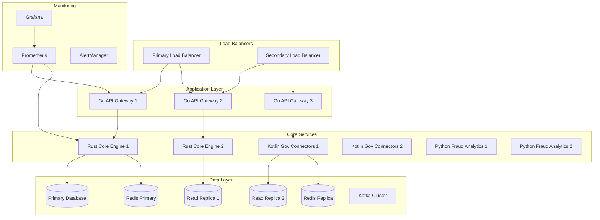

# 🔧 UK Digital Identity Platform - Operations Guide

## 📋 Overview

This operations guide provides comprehensive information for system administrators, DevOps engineers, and operations teams managing the UK Digital Identity Platform in production environments.

## 🏗️ Infrastructure Overview

### System Architecture


### Environment Specifications

| Environment | Purpose | Resources | Availability |
|-------------|---------|-----------|--------------|
| **Production** | Live system serving citizens | 12 nodes, 768GB RAM, 48 cores | 99.99% SLA |
| **Staging** | Pre-production testing | 6 nodes, 384GB RAM, 24 cores | 99.9% target |
| **Development** | Development and testing | 3 nodes, 192GB RAM, 12 cores | Best effort |

## 🚀 Deployment Procedures

### Production Deployment Checklist

#### Pre-Deployment (T-24 hours)
- [ ] **Code Review**: All changes peer reviewed and approved
- [ ] **Security Scan**: Vulnerability scanning completed
- [ ] **Performance Testing**: Load testing results analyzed
- [ ] **Database Migration**: Migration scripts tested on staging
- [ ] **Rollback Plan**: Rollback procedure documented and tested
- [ ] **Stakeholder Notification**: Deployment window communicated
- [ ] **Monitoring Setup**: Additional monitoring configured if needed

#### Deployment Window (T-0)
- [ ] **Maintenance Mode**: Enable maintenance page
- [ ] **Health Check**: Verify system health before deployment
- [ ] **Backup Creation**: Create database and configuration backups
- [ ] **Service Scaling**: Scale services appropriately
- [ ] **Deployment Execution**: Execute deployment procedure
- [ ] **Health Verification**: Verify all services are healthy
- [ ] **Smoke Testing**: Execute critical path tests
- [ ] **Performance Validation**: Check system performance metrics
- [ ] **Maintenance Mode Disable**: Remove maintenance page
- [ ] **Monitoring**: Monitor system for 2 hours post-deployment

#### Post-Deployment (T+2 hours)
- [ ] **Metrics Review**: Analyze performance and error metrics
- [ ] **User Feedback**: Monitor user reports and feedback
- [ ] **Capacity Analysis**: Verify resource utilization is within limits
- [ ] **Documentation Update**: Update deployment logs and documentation

### Blue-Green Deployment Process

```bash
#!/bin/bash
# Blue-Green Deployment Script

set -e

NAMESPACE="digital-identity"
NEW_VERSION="$1"
CURRENT_VERSION=$(kubectl get deployment api-gateway -o jsonpath='{.spec.template.spec.containers[0].image}' | cut -d: -f2)

echo "Starting blue-green deployment from ${CURRENT_VERSION} to ${NEW_VERSION}"

# Step 1: Deploy new version (green) alongside current (blue)
echo "Deploying green environment..."
kubectl apply -f k8s/green-deployment.yaml
kubectl set image deployment/api-gateway-green api-gateway=digital-identity/api-gateway:${NEW_VERSION}

# Step 2: Wait for green deployment to be ready
echo "Waiting for green deployment..."
kubectl rollout status deployment/api-gateway-green -n ${NAMESPACE} --timeout=600s

# Step 3: Run health checks on green environment
echo "Running health checks on green environment..."
GREEN_POD=$(kubectl get pods -l app=api-gateway-green -o jsonpath='{.items[0].metadata.name}')
kubectl exec ${GREEN_POD} -- curl -f http://localhost:8081/health || {
    echo "Health check failed on green environment"
    kubectl delete deployment api-gateway-green
    exit 1
}

# Step 4: Switch traffic to green environment
echo "Switching traffic to green environment..."
kubectl patch service api-gateway -p '{"spec":{"selector":{"version":"green"}}}'

# Step 5: Monitor for 5 minutes
echo "Monitoring green environment for 5 minutes..."
sleep 300

# Step 6: Verify green environment stability
ERROR_RATE=$(curl -s "http://prometheus:9090/api/v1/query?query=rate(http_requests_total{status=~\"5..\"}[5m])" | jq '.data.result[0].value[1] // 0' | cut -d'"' -f2)
if (( $(echo "${ERROR_RATE} > 0.05" | bc -l) )); then
    echo "Error rate too high (${ERROR_RATE}), rolling back..."
    kubectl patch service api-gateway -p '{"spec":{"selector":{"version":"blue"}}}'
    kubectl delete deployment api-gateway-green
    exit 1
fi

# Step 7: Clean up old blue environment
echo "Deployment successful, cleaning up blue environment..."
kubectl delete deployment api-gateway-blue
kubectl patch deployment api-gateway-green -p '{"metadata":{"name":"api-gateway-blue"}}'

echo "Blue-green deployment completed successfully"
```

### Canary Deployment Process

```yaml
# canary-deployment.yaml
apiVersion: argoproj.io/v1alpha1
kind: Rollout
metadata:
  name: api-gateway-canary
spec:
  replicas: 10
  strategy:
    canary:
      steps:
      - setWeight: 10    # Route 10% of traffic to new version
      - pause: {duration: 5m}
      - setWeight: 25    # Increase to 25%
      - pause: {duration: 10m}
      - setWeight: 50    # Increase to 50%
      - pause: {duration: 15m}
      - setWeight: 75    # Increase to 75%
      - pause: {duration: 10m}
      # Automatic promotion to 100% if no rollback triggered
      canaryService: api-gateway-canary
      stableService: api-gateway-stable
      trafficRouting:
        nginx:
          stableIngress: api-gateway-stable
          annotationPrefix: nginx.ingress.kubernetes.io
      analysis:
        templates:
        - templateName: success-rate
        args:
        - name: service-name
          value: api-gateway
        - name: prometheus-server
          value: http://prometheus:9090
```

## 📊 Monitoring and Alerting

### Key Performance Indicators (KPIs)

#### System Health Metrics
```yaml
# Prometheus Rules
groups:
- name: system-health
  rules:
  - alert: HighCPUUsage
    expr: cpu_usage_percent > 80
    for: 5m
    labels:
      severity: warning
    annotations:
      summary: "High CPU usage detected"
      description: "CPU usage is above 80% for more than 5 minutes"

  - alert: HighMemoryUsage
    expr: memory_usage_percent > 85
    for: 3m
    labels:
      severity: critical
    annotations:
      summary: "High memory usage detected"
      description: "Memory usage is above 85% for more than 3 minutes"

  - alert: DatabaseConnectionsHigh
    expr: postgresql_connections_active / postgresql_connections_max > 0.9
    for: 2m
    labels:
      severity: warning
    annotations:
      summary: "Database connection pool nearly exhausted"
      description: "Active connections are above 90% of maximum"
```

#### Application Metrics
```yaml
- name: application-health
  rules:
  - alert: HighErrorRate
    expr: rate(http_requests_total{status=~"5.."}[5m]) / rate(http_requests_total[5m]) > 0.05
    for: 2m
    labels:
      severity: critical
    annotations:
      summary: "High error rate detected"
      description: "Error rate is above 5% for more than 2 minutes"

  - alert: SlowResponseTime
    expr: histogram_quantile(0.95, rate(http_request_duration_seconds_bucket[5m])) > 2
    for: 5m
    labels:
      severity: warning
    annotations:
      summary: "Slow response times detected"
      description: "95th percentile response time is above 2 seconds"

  - alert: VerificationQueueBacklog
    expr: verification_queue_size > 1000
    for: 5m
    labels:
      severity: warning
    annotations:
      summary: "Identity verification queue backlog"
      description: "Verification queue has more than 1000 pending requests"
```

#### Business Metrics
```yaml
- name: business-metrics
  rules:
  - alert: LowRegistrationRate
    expr: rate(user_registrations_total[1h]) < 50
    for: 30m
    labels:
      severity: warning
    annotations:
      summary: "Low user registration rate"
      description: "User registrations are below 50 per hour"

  - alert: FraudDetectionDown
    expr: up{job="fraud-analytics"} == 0
    for: 1m
    labels:
      severity: critical
    annotations:
      summary: "Fraud detection service is down"
      description: "Fraud detection service is not responding"

  - alert: GovernmentAPIFailures
    expr: rate(government_api_requests_failed_total[10m]) > 10
    for: 5m
    labels:
      severity: critical
    annotations:
      summary: "High government API failure rate"
      description: "Government API requests are failing at high rate"
```

### Grafana Dashboards

#### System Overview Dashboard
```json
{
  "dashboard": {
    "title": "UK Digital Identity Platform - System Overview",
    "panels": [
      {
        "title": "System Health",
        "type": "stat",
        "targets": [
          {
            "expr": "up{job=\"api-gateway\"}",
            "legendFormat": "API Gateway"
          },
          {
            "expr": "up{job=\"core-engine\"}",
            "legendFormat": "Core Engine"
          }
        ]
      },
      {
        "title": "Request Rate",
        "type": "graph",
        "targets": [
          {
            "expr": "rate(http_requests_total[5m])",
            "legendFormat": "{{method}} {{status}}"
          }
        ]
      },
      {
        "title": "Response Time Distribution",
        "type": "heatmap",
        "targets": [
          {
            "expr": "rate(http_request_duration_seconds_bucket[5m])",
            "legendFormat": "{{le}}"
          }
        ]
      }
    ]
  }
}
```

### Alert Escalation Matrix

| Alert Level | Response Time | Escalation Path | Communication |
|-------------|---------------|-----------------|---------------|
| **Critical** | 5 minutes | On-call engineer → Team lead → Manager | Incident channel + SMS |
| **Warning** | 15 minutes | On-call engineer → Team lead | Incident channel |
| **Info** | 1 hour | Logged only | Monitoring channel |

### On-Call Procedures

#### Incident Response Runbook

1. **Initial Response (0-5 minutes)**
   ```bash
   # Check system status
   kubectl get pods -n digital-identity
   kubectl get services -n digital-identity
   
   # Check recent deployments
   kubectl rollout history deployment/api-gateway
   
   # Review recent logs
   kubectl logs -f deployment/api-gateway --tail=100
   ```

2. **Investigation (5-15 minutes)**
   ```bash
   # Check metrics
   curl -s "http://prometheus:9090/api/v1/query?query=up"
   
   # Check database connectivity
   kubectl exec -it postgres-primary -- psql -c "SELECT 1"
   
   # Check external dependencies
   curl -f https://api.hmrc.gov.uk/health
   curl -f https://api.dvla.gov.uk/health
   ```

3. **Mitigation (15-30 minutes)**
   ```bash
   # Scale up if needed
   kubectl scale deployment api-gateway --replicas=6
   
   # Restart unhealthy pods
   kubectl delete pod -l app=api-gateway --field-selector=status.phase!=Running
   
   # Enable circuit breakers
   kubectl patch configmap api-config --patch='{"data":{"circuit_breaker_enabled":"true"}}'
   ```

## 🔒 Security Operations

### Security Monitoring
```yaml
# Security-focused Prometheus rules
- name: security-alerts
  rules:
  - alert: SuspiciousLoginAttempts
    expr: rate(login_attempts_failed_total[5m]) > 50
    for: 2m
    labels:
      severity: warning
    annotations:
      summary: "High rate of failed login attempts"
      description: "More than 50 failed login attempts per 5 minutes"

  - alert: UnauthorizedAPIAccess
    expr: rate(http_requests_total{status="403"}[5m]) > 20
    for: 3m
    labels:
      severity: warning
    annotations:
      summary: "High rate of unauthorized access attempts"
      description: "More than 20 403 responses per 5 minutes"

  - alert: PotentialDataBreach
    expr: rate(database_queries_sensitive[5m]) > 1000
    for: 1m
    labels:
      severity: critical
    annotations:
      summary: "Unusual sensitive data access pattern"
      description: "Abnormally high rate of sensitive data queries"
```

### Security Incident Response

#### Data Breach Response Plan

1. **Immediate Actions (0-1 hour)**
   - [ ] Identify and contain the breach
   - [ ] Preserve evidence and logs
   - [ ] Activate incident response team
   - [ ] Assess scope of compromised data

2. **Short-term Actions (1-24 hours)**
   - [ ] Notify relevant authorities (ICO within 72 hours)
   - [ ] Coordinate with legal and compliance teams
   - [ ] Implement additional security controls
   - [ ] Begin user notification process if required

3. **Long-term Actions (24+ hours)**
   - [ ] Conduct thorough investigation
   - [ ] Implement preventive measures
   - [ ] Update security policies and procedures
   - [ ] Conduct post-incident review

### Access Control Management

#### User Access Review Process
```bash
#!/bin/bash
# Monthly access review script

REVIEW_DATE=$(date +%Y-%m-%d)
OUTPUT_DIR="/var/log/access-reviews/${REVIEW_DATE}"

mkdir -p "${OUTPUT_DIR}"

# Generate user access report
kubectl get rolebindings -A -o json | \
jq '.items[] | select(.metadata.name | contains("user-")) | 
{
  namespace: .metadata.namespace,
  user: .subjects[0].name,
  role: .roleRef.name,
  created: .metadata.creationTimestamp
}' > "${OUTPUT_DIR}/user-access-report.json"

# Generate service account report
kubectl get serviceaccounts -A -o json | \
jq '.items[] | {
  namespace: .metadata.namespace,
  name: .metadata.name,
  secrets: .secrets | length,
  created: .metadata.creationTimestamp
}' > "${OUTPUT_DIR}/service-account-report.json"

# Check for unused accounts
kubectl get users --sort-by='.metadata.creationTimestamp' | \
awk 'NR>1 && $4 < "'$(date -d '90 days ago' '+%Y-%m-%d')'" {print $1}' \
> "${OUTPUT_DIR}/stale-accounts.txt"

echo "Access review completed. Reports generated in ${OUTPUT_DIR}"
```

## 🔄 Backup and Disaster Recovery

### Backup Procedures

#### Database Backup Strategy
```bash
#!/bin/bash
# Automated database backup script

BACKUP_DATE=$(date +%Y%m%d_%H%M%S)
BACKUP_DIR="/var/backups/postgresql"
RETENTION_DAYS=30

# Create backup directory
mkdir -p "${BACKUP_DIR}/${BACKUP_DATE}"

# Perform database backup
kubectl exec postgresql-primary -- pg_dumpall -U postgres | \
gzip > "${BACKUP_DIR}/${BACKUP_DATE}/full_backup.sql.gz"

# Backup specific sensitive tables separately
for table in users credentials audit_logs; do
    kubectl exec postgresql-primary -- pg_dump -U postgres \
        -t "${table}" digital_identity | \
        gzip > "${BACKUP_DIR}/${BACKUP_DATE}/${table}_backup.sql.gz"
done

# Upload to secure cloud storage
aws s3 cp "${BACKUP_DIR}/${BACKUP_DATE}" \
    "s3://uk-digital-identity-backups/database/${BACKUP_DATE}/" \
    --recursive --storage-class GLACIER

# Cleanup old local backups
find "${BACKUP_DIR}" -type d -mtime +${RETENTION_DAYS} -exec rm -rf {} +

echo "Database backup completed: ${BACKUP_DATE}"
```

#### Configuration Backup
```bash
#!/bin/bash
# Kubernetes configuration backup

BACKUP_DATE=$(date +%Y%m%d_%H%M%S)
BACKUP_DIR="/var/backups/kubernetes"

mkdir -p "${BACKUP_DIR}/${BACKUP_DATE}"

# Backup all Kubernetes resources
kubectl get all -A -o yaml > "${BACKUP_DIR}/${BACKUP_DATE}/all-resources.yaml"
kubectl get configmaps -A -o yaml > "${BACKUP_DIR}/${BACKUP_DATE}/configmaps.yaml"
kubectl get secrets -A -o yaml > "${BACKUP_DIR}/${BACKUP_DATE}/secrets.yaml"
kubectl get persistentvolumes -o yaml > "${BACKUP_DIR}/${BACKUP_DATE}/pv.yaml"

# Backup ETCD (if managing cluster directly)
etcdctl snapshot save "${BACKUP_DIR}/${BACKUP_DATE}/etcd-snapshot.db"

# Upload to secure storage
aws s3 cp "${BACKUP_DIR}/${BACKUP_DATE}" \
    "s3://uk-digital-identity-backups/kubernetes/${BACKUP_DATE}/" \
    --recursive --storage-class STANDARD_IA
```

### Disaster Recovery Procedures

#### Recovery Time Objectives (RTO) and Recovery Point Objectives (RPO)

| Component | RTO | RPO | Recovery Method |
|-----------|-----|-----|-----------------|
| **API Gateway** | 15 minutes | 5 minutes | Kubernetes auto-healing + manual intervention |
| **Core Engine** | 20 minutes | 15 minutes | Container restart + configuration restore |
| **Database** | 30 minutes | 1 hour | Point-in-time recovery from backups |
| **Government APIs** | N/A | N/A | Dependent on external services |
| **Full System** | 2 hours | 4 hours | Complete infrastructure rebuild |

#### Disaster Recovery Runbook

1. **Assessment Phase (0-15 minutes)**
   ```bash
   # Assess scope of disaster
   kubectl get nodes
   kubectl get pods -A | grep -v Running
   
   # Check database connectivity
   kubectl exec postgresql-primary -- psql -c "SELECT NOW()"
   
   # Verify backup integrity
   aws s3 ls s3://uk-digital-identity-backups/database/ | tail -5
   ```

2. **Recovery Phase (15 minutes - 2 hours)**
   ```bash
   # Restore database from backup
   LATEST_BACKUP=$(aws s3 ls s3://uk-digital-identity-backups/database/ | \
                   sort | tail -1 | awk '{print $2}')
   
   aws s3 cp "s3://uk-digital-identity-backups/database/${LATEST_BACKUP}/" \
             "/tmp/restore/" --recursive
   
   # Restore database
   kubectl exec postgresql-primary -- psql -U postgres < \
       /tmp/restore/full_backup.sql
   
   # Redeploy applications
   kubectl apply -f k8s/
   
   # Verify service health
   kubectl get pods -A
   curl -f http://api-gateway/health
   ```

3. **Validation Phase (Final 30 minutes)**
   ```bash
   # Run comprehensive health checks
   ./scripts/health-check.sh
   
   # Test critical user journeys
   ./scripts/smoke-tests.sh
   
   # Verify data integrity
   kubectl exec postgresql-primary -- psql -c \
       "SELECT COUNT(*) FROM users; SELECT COUNT(*) FROM credentials;"
   ```

## 📈 Capacity Planning

### Resource Utilization Monitoring

#### CPU and Memory Trends
```bash
#!/bin/bash
# Capacity planning data collection

# Collect resource utilization data
kubectl top nodes > /tmp/node-utilization.txt
kubectl top pods -A > /tmp/pod-utilization.txt

# Query historical data from Prometheus
curl -s "http://prometheus:9090/api/v1/query_range" \
     -d "query=avg(cpu_usage_percent)" \
     -d "start=$(date -d '7 days ago' +%s)" \
     -d "end=$(date +%s)" \
     -d "step=3600" | \
     jq '.data.result[0].values' > /tmp/cpu-trend-7d.json

curl -s "http://prometheus:9090/api/v1/query_range" \
     -d "query=avg(memory_usage_percent)" \
     -d "start=$(date -d '7 days ago' +%s)" \
     -d "end=$(date +%s)" \
     -d "step=3600" | \
     jq '.data.result[0].values' > /tmp/memory-trend-7d.json
```

#### Growth Projections

| Metric | Current | 3 Months | 6 Months | 12 Months |
|--------|---------|----------|----------|-----------|
| **Active Users** | 1.2M | 1.8M | 2.5M | 4.2M |
| **Daily Transactions** | 850K | 1.3M | 1.8M | 3.2M |
| **Storage (TB)** | 2.1 | 3.2 | 4.8 | 8.7 |
| **CPU Cores** | 48 | 72 | 96 | 168 |
| **Memory (GB)** | 768 | 1152 | 1536 | 2688 |

### Scaling Strategies

#### Horizontal Pod Autoscaler (HPA) Configuration
```yaml
apiVersion: autoscaling/v2
kind: HorizontalPodAutoscaler
metadata:
  name: api-gateway-hpa
spec:
  scaleTargetRef:
    apiVersion: apps/v1
    kind: Deployment
    name: api-gateway
  minReplicas: 3
  maxReplicas: 20
  metrics:
  - type: Resource
    resource:
      name: cpu
      target:
        type: Utilization
        averageUtilization: 70
  - type: Resource
    resource:
      name: memory
      target:
        type: Utilization
        averageUtilization: 80
  - type: Pods
    pods:
      metric:
        name: http_requests_per_second
      target:
        type: AverageValue
        averageValue: "1000"
```

#### Advanced HPA with Custom Metrics
```yaml
apiVersion: autoscaling/v2
kind: HorizontalPodAutoscaler
metadata:
  name: fraud-analytics-hpa
spec:
  scaleTargetRef:
    apiVersion: apps/v1
    kind: Deployment
    name: fraud-analytics
  minReplicas: 2
  maxReplicas: 10
  metrics:
  - type: External
    external:
      metric:
        name: kafka_queue_length
        selector:
          matchLabels:
            topic: fraud-detection
      target:
        type: Value
        value: "100"
  - type: External
    external:
      metric:
        name: sync_event_backlog
        selector:
          matchLabels:
            service: fraud-analytics
      target:
        type: Value
        value: "50"
  behavior:
    scaleUp:
      stabilizationWindowSeconds: 60
      policies:
      - type: Percent
        value: 100
        periodSeconds: 60
    scaleDown:
      stabilizationWindowSeconds: 300
      policies:
      - type: Percent
        value: 20
        periodSeconds: 60
```

### Network Policies Management

#### Production Network Security
```yaml
# infra/k8s/network-policies.yaml
apiVersion: networking.k8s.io/v1
kind: NetworkPolicy
metadata:
  name: sync-service-policy
  namespace: digital-identity
spec:
  podSelector:
    matchLabels:
      component: sync-service
  policyTypes:
  - Ingress
  - Egress
  ingress:
  - from:
    - podSelector:
        matchLabels:
          app: api-gateway
    ports:
    - protocol: TCP
      port: 8080
  - from:
    - podSelector:
        matchLabels:
          app: core-engine
    ports:
    - protocol: TCP
      port: 3000
  egress:
  - to:
    - podSelector:
        matchLabels:
          app: redis
    ports:
    - protocol: TCP
      port: 6379
  - to:
    - podSelector:
        matchLabels:
          app: kafka
    ports:
    - protocol: TCP
      port: 9092
  - to:
    - podSelector:
        matchLabels:
          app: postgresql
    ports:
    - protocol: TCP
      port: 5432
```

#### Sync Traffic Monitoring
```bash
#!/bin/bash
# Network policy monitoring script

NAMESPACE="digital-identity"
OUTPUT_FILE="/var/log/network-policy-audit.log"

echo "$(date): Starting network policy audit" >> "$OUTPUT_FILE"

# Check network policy violations
kubectl get events -n "$NAMESPACE" --field-selector reason=NetworkPolicy -o json | \
jq -r '.items[] | select(.type=="Warning") | "\(.lastTimestamp): \(.message)"' >> "$OUTPUT_FILE"

# Monitor sync traffic patterns
kubectl exec -it redis-primary -- redis-cli --eval /scripts/traffic-monitor.lua >> "$OUTPUT_FILE"

# Check for unauthorized connections
kubectl logs -n "$NAMESPACE" -l app=network-policy-controller --tail=100 | \
grep -i "denied\|blocked\|violation" >> "$OUTPUT_FILE"

echo "$(date): Network policy audit completed" >> "$OUTPUT_FILE"
```

## 🔄 Sync System Operations

### Sync Health Monitoring
```yaml
# Sync-specific Prometheus alerts
groups:
- name: sync-system-alerts
  rules:
  - alert: SyncServiceDown
    expr: up{job="sync-service"} == 0
    for: 5m
    labels:
      severity: critical
    annotations:
      summary: "Sync service is down"
      description: "Real-time synchronization service is not responding"
  
  - alert: HighSyncLatency
    expr: histogram_quantile(0.95, rate(sync_request_duration_seconds_bucket[5m])) > 1
    for: 5m
    labels:
      severity: warning
    annotations:
      summary: "High sync request latency"
      description: "95th percentile sync latency above 1 second"
  
  - alert: SyncEventBacklog
    expr: redis_queue_length{queue="sync-events"} > 1000
    for: 2m
    labels:
      severity: warning
    annotations:
      summary: "Sync event queue backlog"
      description: "More than 1000 sync events queued"
  
  - alert: GovernmentFeedDisconnect
    expr: up{job="government-feed-connector"} == 0
    for: 10m
    labels:
      severity: critical
    annotations:
      summary: "Government feed disconnected"
      description: "Government data feed synchronization lost"
```

### Sync Performance Optimization
```bash
#!/bin/bash
# Sync performance monitoring script

# Monitor Redis pub/sub performance
kubectl exec -it redis-primary -- redis-cli info pubsub | \
grep -E "(channels|patterns|clients)" > /tmp/redis-pubsub-stats.txt

# Check Kafka sync topic throughput
kubectl exec -it kafka-broker -- kafka-run-class.sh \
    kafka.tools.GetOffsetShell \
    --broker-list localhost:9092 \
    --topic sync-events \
    --time -1 > /tmp/kafka-sync-offsets.txt

# Monitor WebSocket connection health
curl -s "http://prometheus:9090/api/v1/query?query=websocket_active_connections" | \
jq '.data.result[0].value[1]' > /tmp/websocket-connections.txt

# Generate sync performance report
cat > /tmp/sync-performance-report.txt << EOF
=== Sync Performance Report $(date) ===

Redis Pub/Sub Stats:
$(cat /tmp/redis-pubsub-stats.txt)

Kafka Sync Throughput:
$(cat /tmp/kafka-sync-offsets.txt)

Active WebSocket Connections:
$(cat /tmp/websocket-connections.txt)

Recommendations:
$(if [ $(cat /tmp/websocket-connections.txt) -gt 10000 ]; then
    echo "- Consider scaling WebSocket service"
  fi)
$(if [ $(grep "channels:" /tmp/redis-pubsub-stats.txt | cut -d: -f2) -gt 1000 ]; then
    echo "- High number of pub/sub channels, monitor memory usage"
  fi)
EOF

# Send report to operations team
mail -s "Daily Sync Performance Report" ops@digital-identity.gov.uk < /tmp/sync-performance-report.txt
```

## 🚨 Troubleshooting Guide
```

#### Vertical Pod Autoscaler (VPA) Configuration
```yaml
apiVersion: autoscaling.k8s.io/v1
kind: VerticalPodAutoscaler
metadata:
  name: core-engine-vpa
spec:
  targetRef:
    apiVersion: apps/v1
    kind: Deployment
    name: core-engine
  updatePolicy:
    updateMode: "Auto"
  resourcePolicy:
    containerPolicies:
    - containerName: core-engine
      minAllowed:
        cpu: 100m
        memory: 256Mi
      maxAllowed:
        cpu: 2
        memory: 4Gi
```

## 🚨 Troubleshooting Guide

### Common Issues and Solutions

#### Service Discovery Issues
```bash
# Problem: Services cannot communicate
# Check DNS resolution
kubectl exec -it api-gateway-pod -- nslookup core-engine-service
kubectl exec -it api-gateway-pod -- wget -qO- http://core-engine-service:8080/health

# Check service endpoints
kubectl get endpoints core-engine-service
kubectl describe service core-engine-service

# Solution: Restart CoreDNS if needed
kubectl delete pod -n kube-system -l k8s-app=kube-dns
```

#### Database Connection Issues
```bash
# Problem: Database connection pool exhaustion
# Check active connections
kubectl exec postgresql-primary -- psql -c \
    "SELECT count(*) FROM pg_stat_activity WHERE state = 'active';"

# Check connection pool configuration
kubectl exec postgresql-primary -- psql -c "SHOW max_connections;"

# Solution: Increase connection limits or restart connections
kubectl exec postgresql-primary -- psql -c \
    "SELECT pg_terminate_backend(pid) FROM pg_stat_activity 
     WHERE state = 'idle' AND state_change < now() - interval '5 minutes';"
```

#### Performance Degradation
```bash
# Problem: Slow API response times
# Check resource utilization
kubectl top pods -A --sort-by=cpu
kubectl top pods -A --sort-by=memory

# Check for memory leaks
kubectl exec api-gateway-pod -- ps aux | head -20

# Check database query performance
kubectl exec postgresql-primary -- psql -c \
    "SELECT query, mean_time, calls FROM pg_stat_statements 
     ORDER BY mean_time DESC LIMIT 10;"

# Solution: Scale resources or optimize queries
kubectl scale deployment api-gateway --replicas=6
```

### Log Analysis

#### Centralized Logging with ELK Stack
```bash
# Search for errors across all services
curl -X GET "elasticsearch:9200/logstash-*/_search" \
     -H 'Content-Type: application/json' \
     -d '{
       "query": {
         "bool": {
           "must": [
             {"range": {"@timestamp": {"gte": "now-1h"}}},
             {"match": {"level": "ERROR"}}
           ]
         }
       },
       "sort": [{"@timestamp": {"order": "desc"}}],
       "size": 100
     }'

# Analyze error patterns
curl -X GET "elasticsearch:9200/logstash-*/_search" \
     -H 'Content-Type: application/json' \
     -d '{
       "size": 0,
       "aggs": {
         "error_types": {
           "terms": {
             "field": "error.keyword",
             "size": 10
           }
         }
       }
     }'
```

## 📊 Performance Optimization

### Database Optimization

#### Query Performance Monitoring
```sql
-- Enable query statistics
ALTER SYSTEM SET shared_preload_libraries = 'pg_stat_statements';
ALTER SYSTEM SET pg_stat_statements.track = 'all';

-- Analyze slow queries
SELECT 
    query,
    calls,
    total_time,
    mean_time,
    rows,
    100.0 * shared_blks_hit / nullif(shared_blks_hit + shared_blks_read, 0) AS hit_percent
FROM pg_stat_statements 
WHERE mean_time > 1000  -- queries taking more than 1 second
ORDER BY mean_time DESC 
LIMIT 20;

-- Check index usage
SELECT 
    schemaname,
    tablename,
    attname,
    n_distinct,
    correlation 
FROM pg_stats 
WHERE tablename IN ('users', 'credentials', 'audit_logs');
```

#### Index Optimization
```sql
-- Create performance-optimized indexes
CREATE INDEX CONCURRENTLY idx_users_email_hash ON users USING hash(email);
CREATE INDEX CONCURRENTLY idx_credentials_user_created ON credentials(user_id, created_at);
CREATE INDEX CONCURRENTLY idx_audit_logs_timestamp_action ON audit_logs(timestamp, action) WHERE timestamp > '2024-01-01';

-- Partial indexes for better performance
CREATE INDEX CONCURRENTLY idx_active_credentials ON credentials(user_id, status) WHERE status = 'active';
CREATE INDEX CONCURRENTLY idx_recent_logins ON audit_logs(user_id, timestamp) WHERE action = 'login' AND timestamp > now() - interval '30 days';
```

### Application Performance Optimization

#### Caching Strategy Implementation
```rust
// Redis caching layer
use redis::AsyncCommands;
use serde::{Deserialize, Serialize};

#[derive(Serialize, Deserialize)]
pub struct CachedUserProfile {
    pub user_id: String,
    pub name: String,
    pub verification_level: i32,
    pub cached_at: DateTime<Utc>,
}

impl CacheService {
    pub async fn get_user_profile(&self, user_id: &str) -> Result<Option<CachedUserProfile>> {
        let cache_key = format!("user_profile:{}", user_id);
        
        // Try L1 cache (in-memory)
        if let Some(profile) = self.l1_cache.get(&cache_key) {
            return Ok(Some(profile));
        }
        
        // Try L2 cache (Redis)
        let cached_data: Option<String> = self.redis
            .get(&cache_key)
            .await
            .unwrap_or(None);
        
        if let Some(data) = cached_data {
            let profile: CachedUserProfile = serde_json::from_str(&data)?;
            
            // Populate L1 cache
            self.l1_cache.insert(cache_key.clone(), profile.clone());
            
            return Ok(Some(profile));
        }
        
        Ok(None)
    }
    
    pub async fn cache_user_profile(&self, profile: &CachedUserProfile) -> Result<()> {
        let cache_key = format!("user_profile:{}", profile.user_id);
        let serialized = serde_json::to_string(profile)?;
        
        // Cache in both L1 and L2
        self.l1_cache.insert(cache_key.clone(), profile.clone());
        
        self.redis
            .set_ex(&cache_key, serialized, 300) // 5 minute TTL
            .await?;
        
        Ok(())
    }
}
```

---

*This operations guide provides comprehensive procedures for managing the UK Digital Identity Platform in production. Regular updates and reviews ensure operational excellence and system reliability.*