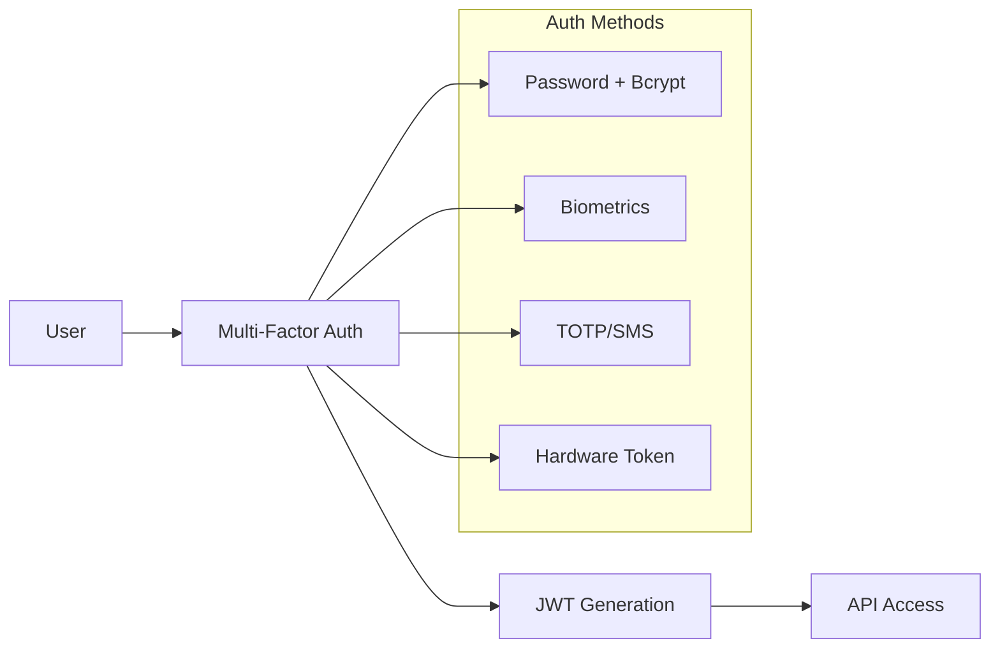
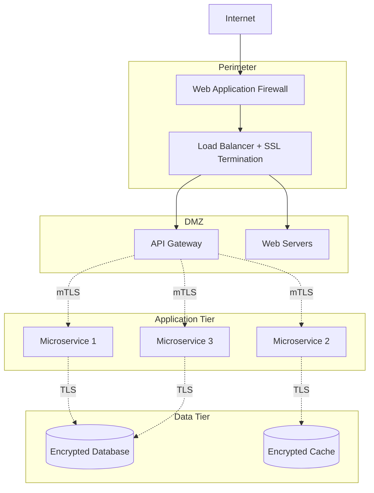

# 🔐 UK Digital Identity Platform - Security Guide

## 📘 Overview

This document provides comprehensive security guidelines, threat models, and security implementation details for the UK Digital Identity Platform. The platform implements defense-in-depth security with multiple layers of protection.

## 🛡️ Security Framework

### Security Objectives
1. **Confidentiality**: Protect citizen personal data and credentials
2. **Integrity**: Ensure data accuracy and prevent tampering
3. **Availability**: Maintain 99.9% system uptime and reliability
4. **Authentication**: Verify user and system identities
5. **Authorization**: Control access to resources and operations
6. **Non-repudiation**: Maintain immutable audit trails
7. **Privacy**: Implement data minimization and consent management

## 🎯 Threat Model

### Threat Actors

#### External Threats
- **Cybercriminals**: Financial fraud, identity theft
- **Nation State Actors**: Espionage, system disruption
- **Hacktivists**: Political protests, service disruption
- **Script Kiddies**: Opportunistic attacks, defacement

#### Internal Threats
- **Malicious Insiders**: Privilege abuse, data theft
- **Compromised Accounts**: Credential stuffing, phishing
- **Supply Chain**: Third-party vulnerabilities
- **Accidental**: Human error, misconfigurations

### Attack Vectors

#### Network Attacks
- **DDoS**: Service availability attacks
- **Man-in-the-Middle**: Communication interception
- **Network Intrusion**: Lateral movement
- **DNS Poisoning**: Traffic redirection

#### Application Attacks
- **SQL Injection**: Database compromise
- **XSS**: Client-side code injection
- **CSRF**: Cross-site request forgery
- **API Abuse**: Rate limiting bypass

#### Identity Attacks
- **Credential Stuffing**: Password reuse attacks
- **Phishing**: Social engineering
- **Session Hijacking**: Token theft
- **Privilege Escalation**: Authorization bypass

## 🔒 Security Implementation

### 1. Cryptographic Security

#### Core Cryptography (Rust Engine)
```rust
// RING-based encryption with AES-GCM
use ring::{aead, rand};
use ring::aead::{AES_256_GCM, BoundKey, OpeningKey, SealingKey};

pub struct CryptoManager {
    sealing_key: SealingKey<OneNonceSequence>,
    opening_key: OpeningKey<OneNonceSequence>,
}

impl CryptoManager {
    pub fn encrypt(&mut self, plaintext: &[u8]) -> Result<Vec<u8>, CryptoError> {
        let mut ciphertext = plaintext.to_vec();
        ciphertext.resize(plaintext.len() + AES_256_GCM.tag_len(), 0);
        
        let tag = self.sealing_key
            .seal_in_place_separate_tag(
                aead::Aad::empty(),
                &mut ciphertext[..plaintext.len()],
            )?;
        
        ciphertext[plaintext.len()..].copy_from_slice(tag.as_ref());
        Ok(ciphertext)
    }
}
```

#### Key Management
- **Hardware Security Modules (HSM)**: Production key storage
- **HashiCorp Vault**: Development and staging secrets
- **Key Rotation**: Automated 90-day rotation cycle
- **Key Derivation**: PBKDF2 with 100,000 iterations
- **Perfect Forward Secrecy**: Ephemeral session keys

#### Encryption Standards
| Data Type | Algorithm | Key Size | Usage |
|-----------|-----------|----------|-------|
| **Database** | AES-GCM | 256-bit | PII encryption at rest |
| **Communication** | TLS 1.3 | 256-bit | Data in transit |
| **Credentials** | AES-GCM | 256-bit | Digital credential storage |
| **Signatures** | Ed25519 | 256-bit | Digital signatures |
| **Hashing** | Blake3 | 256-bit | Data integrity |

### 2. Identity & Access Management

#### Authentication Architecture


#### JWT Token Security
```go
// Go JWT implementation with security controls
type JWTClaims struct {
    UserID    string    `json:"user_id"`
    Role      string    `json:"role"`
    Scope     []string  `json:"scope"`
    IssuedAt  int64     `json:"iat"`
    ExpiresAt int64     `json:"exp"`
    NotBefore int64     `json:"nbf"`
    Issuer    string    `json:"iss"`
    Audience  string    `json:"aud"`
    JTI       string    `json:"jti"` // Unique token ID
}

func GenerateJWT(userID, role string, scopes []string) (string, error) {
    claims := JWTClaims{
        UserID:    userID,
        Role:      role,
        Scope:     scopes,
        IssuedAt:  time.Now().Unix(),
        ExpiresAt: time.Now().Add(15 * time.Minute).Unix(), // Short-lived
        NotBefore: time.Now().Unix(),
        Issuer:    "uk-digital-id",
        Audience:  "digital-id-services",
        JTI:       generateUniqueID(),
    }
    
    token := jwt.NewWithClaims(jwt.SigningMethodHS256, claims)
    return token.SignedString(jwtSecret)
}
```

#### Role-Based Access Control (RBAC)
```yaml
roles:
  citizen:
    permissions:
      - read:own_profile
      - update:own_profile
      - create:verification_request
      - read:own_credentials
  
  government_official:
    permissions:
      - read:user_profiles
      - create:verification_response
      - read:system_metrics
      - access:gov_api_connectors
  
  system_admin:
    permissions:
      - "*" # Full system access
      - manage:users
      - manage:system_config
      - read:audit_logs
```

### 3. Application Security

#### Input Validation & Sanitization
```typescript
// TypeScript input sanitization
import DOMPurify from 'dompurify';
import { z } from 'zod';

// Schema validation
const UserRegistrationSchema = z.object({
  name: z.string().min(2).max(50).regex(/^[a-zA-Z\s]+$/),
  email: z.string().email(),
  password: z.string().min(12).regex(/^(?=.*[a-z])(?=.*[A-Z])(?=.*\d)(?=.*[@$!%*?&])[A-Za-z\d@$!%*?&]/),
  dateOfBirth: z.string().refine((date) => {
    const age = new Date().getFullYear() - new Date(date).getFullYear();
    return age >= 16 && age <= 120;
  })
});

// Input sanitization
function sanitizeInput(input: string): string {
  return DOMPurify.sanitize(input.trim(), {
    ALLOWED_TAGS: [],
    ALLOWED_ATTR: []
  });
}
```

#### API Security Controls
```go
// Rate limiting middleware
func RateLimitMiddleware() gin.HandlerFunc {
    limiter := rate.NewLimiter(rate.Every(time.Minute), 100) // 100 req/min
    
    return gin.HandlerFunc(func(c *gin.Context) {
        if !limiter.Allow() {
            c.JSON(http.StatusTooManyRequests, gin.H{
                "error": "Rate limit exceeded",
                "retry_after": 60,
            })
            c.Abort()
            return
        }
        c.Next()
    })
}

// CORS security
func CORSMiddleware() gin.HandlerFunc {
    return cors.New(cors.Config{
        AllowOrigins:     []string{"https://portal.digital-id.gov.uk", "https://admin.digital-id.gov.uk"},
        AllowMethods:     []string{"GET", "POST", "PUT", "DELETE", "OPTIONS"},
        AllowHeaders:     []string{"Origin", "Content-Type", "Authorization", "X-Requested-With"},
        ExposeHeaders:    []string{"Content-Length"},
        AllowCredentials: true,
        MaxAge:           12 * time.Hour,
    })
}
```

### 4. Database Security

#### Encryption at Rest
```sql
-- PostgreSQL encryption configuration
-- Database-level encryption
CREATE DATABASE digital_id WITH ENCRYPTION;

-- Column-level encryption for PII
CREATE TABLE users (
    id UUID PRIMARY KEY,
    name_encrypted BYTEA, -- AES-256 encrypted
    email_hash VARCHAR(64), -- SHA-256 hash for indexing
    created_at TIMESTAMP WITH TIME ZONE DEFAULT NOW()
);

-- Row-level security
CREATE POLICY user_data_policy ON users
    FOR ALL TO application_role
    USING (user_id = current_setting('app.current_user_id')::UUID);

ALTER TABLE users ENABLE ROW LEVEL SECURITY;
```

#### Database Access Controls
```yaml
# Database security configuration
postgresql:
  authentication:
    method: "scram-sha-256"
    require_ssl: true
    ssl_cert_file: "/etc/ssl/certs/postgresql.crt"
    ssl_key_file: "/etc/ssl/private/postgresql.key"
    ssl_ca_file: "/etc/ssl/certs/ca-certificates.crt"
  
  access_control:
    max_connections: 100
    connection_timeout: "30s"
    idle_timeout: "10m"
    
  backup:
    encryption: "AES-256"
    retention: "7 years" # GDPR compliance
    schedule: "0 2 * * *" # Daily at 2 AM
```

### 5. Network Security

#### Zero Trust Architecture


#### Network Segmentation
```yaml
# Kubernetes Network Policies
apiVersion: networking.k8s.io/v1
kind: NetworkPolicy
metadata:
  name: digital-id-network-policy
spec:
  podSelector: {}
  policyTypes:
  - Ingress
  - Egress
  
  ingress:
  - from:
    - namespaceSelector:
        matchLabels:
          name: digital-identity
    ports:
    - protocol: TCP
      port: 8080
  
  egress:
  - to:
    - namespaceSelector:
        matchLabels:
          name: data-tier
    ports:
    - protocol: TCP
      port: 5432
```

### 6. Fraud Detection Security

#### ML Security Implementation
```python
# Secure ML pipeline
import hashlib
from sklearn.model_selection import train_test_split
from sklearn.preprocessing import StandardScaler
import joblib
import numpy as np

class SecureFraudDetector:
    def __init__(self):
        self.model = None
        self.scaler = StandardScaler()
        self.feature_hash = None
    
    def train_model(self, X, y, validate_features=True):
        """Securely train fraud detection model"""
        
        # Feature validation and hashing
        if validate_features:
            feature_hash = hashlib.sha256(
                str(sorted(X.columns.tolist())).encode()
            ).hexdigest()
            self.feature_hash = feature_hash
        
        # Secure data splitting
        X_train, X_test, y_train, y_test = train_test_split(
            X, y, test_size=0.2, random_state=42, stratify=y
        )
        
        # Data normalization
        X_train_scaled = self.scaler.fit_transform(X_train)
        X_test_scaled = self.scaler.transform(X_test)
        
        # Model training with security controls
        from xgboost import XGBClassifier
        self.model = XGBClassifier(
            n_estimators=100,
            max_depth=6,
            learning_rate=0.1,
            random_state=42,
            n_jobs=-1,
            tree_method='approx'  # Differential privacy support
        )
        
        self.model.fit(X_train_scaled, y_train)
        
        # Model validation
        accuracy = self.model.score(X_test_scaled, y_test)
        if accuracy < 0.85:  # Minimum accuracy threshold
            raise ValueError(f"Model accuracy {accuracy} below threshold")
        
        return accuracy
    
    def detect_fraud(self, transaction_data):
        """Secure fraud detection with input validation"""
        
        # Validate model exists
        if self.model is None:
            raise ValueError("Model not trained")
        
        # Feature validation
        current_hash = hashlib.sha256(
            str(sorted(transaction_data.columns.tolist())).encode()
        ).hexdigest()
        
        if current_hash != self.feature_hash:
            raise ValueError("Feature schema mismatch - possible attack")
        
        # Input sanitization
        transaction_data = transaction_data.replace([np.inf, -np.inf], np.nan)
        transaction_data = transaction_data.fillna(0)
        
        # Prediction with confidence
        scaled_data = self.scaler.transform(transaction_data)
        probability = self.model.predict_proba(scaled_data)[0][1]
        prediction = int(probability > 0.5)
        
        return {
            'is_fraud': bool(prediction),
            'confidence': float(probability),
            'risk_level': self._get_risk_level(probability)
        }
    
    def _get_risk_level(self, probability):
        if probability < 0.3:
            return 'LOW'
        elif probability < 0.6:
            return 'MEDIUM'
        elif probability < 0.8:
            return 'HIGH'
        else:
            return 'CRITICAL'
```

## 🚨 Incident Response

### Security Monitoring

#### Real-time Alerting
```yaml
# Prometheus alerting rules
groups:
- name: security_alerts
  rules:
  - alert: SuspiciousLoginActivity
    expr: increase(failed_login_attempts[5m]) > 10
    for: 1m
    labels:
      severity: warning
    annotations:
      summary: "High number of failed login attempts detected"
  
  - alert: UnauthorizedAPIAccess
    expr: increase(http_requests_total{status=~"4..|5.."}[5m]) > 50
    for: 2m
    labels:
      severity: critical
    annotations:
      summary: "High number of HTTP errors detected - possible attack"
  
  - alert: DatabaseConnectionSpike
    expr: increase(database_connections_active[1m]) > 80
    for: 30s
    labels:
      severity: warning
    annotations:
      summary: "Unusual database connection activity"
```

#### Security Event Correlation
```python
# Security event analysis
class SecurityEventAnalyzer:
    def __init__(self):
        self.event_correlation = {}
        self.threat_patterns = self._load_threat_patterns()
    
    def analyze_event(self, event):
        """Analyze security events for threat patterns"""
        
        event_signature = self._generate_signature(event)
        
        # Check against known threat patterns
        threat_score = 0
        matched_patterns = []
        
        for pattern in self.threat_patterns:
            if self._matches_pattern(event, pattern):
                threat_score += pattern['severity']
                matched_patterns.append(pattern['name'])
        
        # Generate alert if threshold exceeded
        if threat_score > 70:
            self._generate_alert({
                'event_id': event['id'],
                'threat_score': threat_score,
                'matched_patterns': matched_patterns,
                'recommended_action': self._get_recommended_action(threat_score)
            })
        
        return threat_score
```

### Incident Response Plan

#### Response Phases
1. **Detection**: Automated monitoring and alerting
2. **Analysis**: Threat assessment and impact evaluation
3. **Containment**: Immediate threat mitigation
4. **Eradication**: Root cause elimination
5. **Recovery**: System restoration and validation
6. **Lessons Learned**: Post-incident review and improvement

#### Escalation Matrix
| Severity | Response Time | Escalation |
|----------|---------------|------------|
| **Critical** | 15 minutes | CISO, CTO, CEO |
| **High** | 1 hour | Security Team Lead, Engineering Manager |
| **Medium** | 4 hours | Security Analyst, Dev Team |
| **Low** | 24 hours | Automated response, Daily review |

## 📋 Compliance & Auditing

### Regulatory Compliance

#### GDPR Compliance
- **Data Minimization**: Collect only necessary data
- **Purpose Limitation**: Use data only for stated purposes  
- **Storage Limitation**: Automatic data expiry policies
- **Right to Access**: User data export functionality
- **Right to Rectification**: Data correction mechanisms
- **Right to Erasure**: Secure data deletion processes
- **Data Portability**: Standard export formats

#### UK Data Protection Act 2018
- **Lawful Basis**: Explicit consent and legitimate interest
- **Special Category Data**: Enhanced protection for biometrics
- **Data Protection Impact Assessment**: Regular DPIA reviews
- **Data Breach Notification**: 72-hour reporting requirement

### Audit Framework

#### Continuous Auditing
```sql
-- Audit trail schema
CREATE TABLE audit_log (
    id UUID PRIMARY KEY DEFAULT gen_random_uuid(),
    timestamp TIMESTAMP WITH TIME ZONE DEFAULT NOW(),
    user_id UUID,
    action VARCHAR(100) NOT NULL,
    resource VARCHAR(200),
    ip_address INET,
    user_agent TEXT,
    request_id UUID,
    result VARCHAR(50), -- SUCCESS, FAILURE, PARTIAL
    details JSONB,
    hash VARCHAR(64) -- Integrity hash
);

-- Immutable audit log with hash chain
CREATE OR REPLACE FUNCTION update_audit_hash()
RETURNS TRIGGER AS $$
BEGIN
    -- Calculate hash including previous record
    NEW.hash = encode(
        digest(
            CONCAT(
                NEW.timestamp::TEXT,
                NEW.user_id::TEXT,
                NEW.action,
                NEW.resource,
                COALESCE(LAG(hash) OVER (ORDER BY timestamp), '')
            ),
            'sha256'
        ),
        'hex'
    );
    RETURN NEW;
END;
$$ LANGUAGE plpgsql;

CREATE TRIGGER audit_hash_trigger
    BEFORE INSERT ON audit_log
    FOR EACH ROW EXECUTE FUNCTION update_audit_hash();
```

## 🛠️ Security Testing

### Automated Security Testing
```yaml
# CI/CD security pipeline
security_tests:
  static_analysis:
    - tool: semgrep
      config: security-rules.yml
    - tool: bandit
      language: python
    - tool: gosec
      language: go
  
  dependency_scanning:
    - tool: snyk
      scan: dependencies
    - tool: audit
      package_managers: [npm, cargo, go]
  
  container_scanning:
    - tool: trivy
      scan: [vulnerabilities, secrets, misconfigurations]
  
  dynamic_testing:
    - tool: zap
      type: api_security_scan
      target: staging_environment
```

### Penetration Testing
- **Frequency**: Quarterly external, monthly internal
- **Scope**: Full application stack and infrastructure
- **Standards**: OWASP Testing Guide, NIST guidelines
- **Reporting**: Executive summary with technical details

---

*This security guide provides comprehensive protection strategies for the UK Digital Identity Platform. Regular updates ensure alignment with evolving threat landscapes and regulatory requirements.*